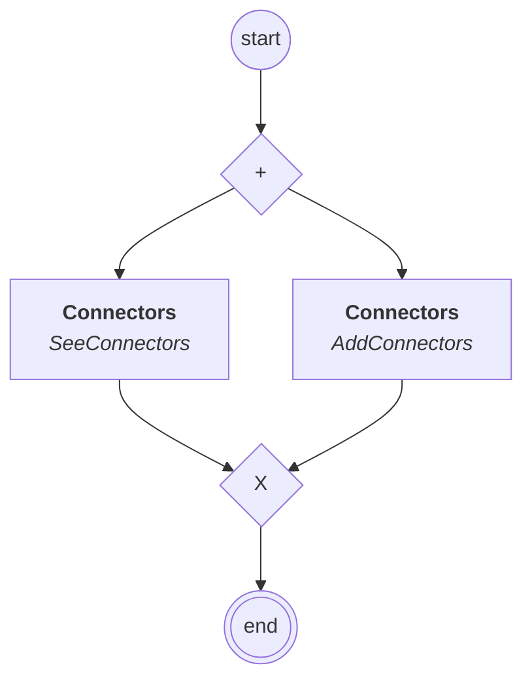

# connectors.core.content

## Process `connectorsmanagement`

| Node | Type | Title | Behaviors |
|---|---|---|---|
| `see` | activity | Connectors | `SeeConnectors` |
| `add` | activity | Connectors | `AddConnectors` |

