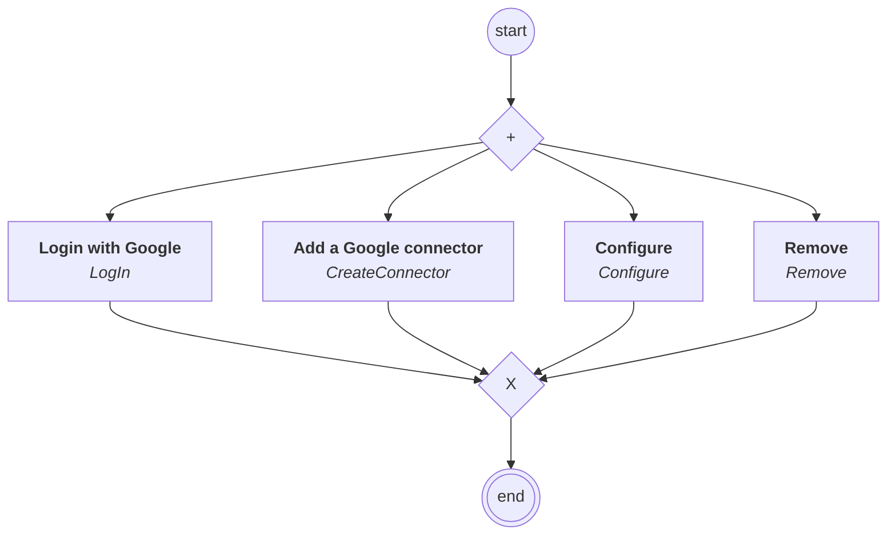

# connectors.google.content

## Process `googleprocess`

| Node | Type | Title | Behaviors |
|---|---|---|---|
| `login` | activity | Login with Google | `LogIn` |
| `create` | activity | Add a Google connector | `CreateConnector` |
| `configure` | activity | Configure | `Configure` |
| `remove` | activity | Remove | `Remove` |

