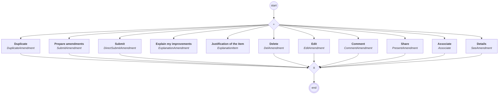

# content.processes.amendment_management

This module represent the Amendments management process definition
powered by the dace engine. This process is unique, which means that
this process is instantiated only once.

## Process `amendmentmanagement`

| Node | Type | Title | Behaviors |
|---|---|---|---|
| `delamendment` | activity | Delete | `DelAmendment` |
| `duplicate` | activity | Duplicate | `DuplicateAmendment` |
| `edit` | activity | Edit | `EditAmendment` |
| `explanation` | activity | Explain my improvements | `ExplanationAmendment` |
| `explanationitem` | activity | Justification of the item | `ExplanationItem` |
| `submit` | activity | Prepare amendments | `SubmitAmendment` |
| `directsubmit` | activity | Submit | `DirectSubmitAmendment` |
| `present` | activity | Share | `PresentAmendment` |
| `comment` | activity | Comment | `CommentAmendment` |
| `associate` | activity | Associate | `Associate` |
| `see` | activity | Details | `SeeAmendment` |

