# content.processes.challenge_management

This module represent the Challenge management process definition
powered by the dace engine. This process is unique, which means that
this process is instantiated only once.

## Process `challengemanagement`

```mermaid
flowchart TD
    n_start(("start"))
    n_creat["<b>Create a challenge</b><br/><i>CreateChallenge</i>"]
    n_creatandpublish["<b>Create a challenge</b><br/><i>CrateAndPublish</i>"]
    n_submit["<b>Submit for publication</b><br/><i>SubmitChallenge</i>"]
    n_delchallenge["<b>Delete</b><br/><i>DelChallenge</i>"]
    n_edit["<b>Edit</b><br/><i>EditChallenge</i>"]
    n_archive["<b>Archive</b><br/><i>ArchiveChallenge</i>"]
    n_publish["<b>Publish</b><br/><i>PublishChallenge</i>"]
    n_present["<b>Share</b><br/><i>PresentChallenge, PresentChallengeAnonymous</i>"]
    n_comment["<b>Comment</b><br/><i>CommentChallenge, CommentChallengeAnonymous</i>"]
    n_associate["<b>Associate</b><br/><i>Associate</i>"]
    n_see["<b>Details</b><br/><i>SeeChallenge</i>"]
    n_seechallenges["<b>The challenges</b><br/><i>SeeChallenges</i>"]
    n_add_members["<b>Add Participants</b><br/><i>AddMembers</i>"]
    n_remove_members["<b>Remove Participants</b><br/><i>RemoveMembers</i>"]
    n_see_members["<b>See Participants</b><br/><i>SeeMembers</i>"]
    n_pg{"+"}
    n_eg{"X"}
    n_end((("end")))
    n_start --> n_pg
    n_pg --> n_creat
    n_pg --> n_creatandpublish
    n_pg --> n_submit
    n_pg --> n_edit
    n_pg --> n_publish
    n_pg --> n_delchallenge
    n_pg --> n_comment
    n_pg --> n_present
    n_pg --> n_associate
    n_pg --> n_see
    n_pg --> n_seechallenges
    n_pg --> n_archive
    n_pg --> n_add_members
    n_pg --> n_remove_members
    n_pg --> n_see_members
    n_creat --> n_eg
    n_creatandpublish --> n_eg
    n_submit --> n_eg
    n_publish --> n_eg
    n_delchallenge --> n_eg
    n_edit --> n_eg
    n_comment --> n_eg
    n_present --> n_eg
    n_associate --> n_eg
    n_see --> n_eg
    n_seechallenges --> n_eg
    n_archive --> n_eg
    n_add_members --> n_eg
    n_remove_members --> n_eg
    n_see_members --> n_eg
    n_eg --> n_end
```

| Node | Type | Title | Behaviors |
|---|---|---|---|
| `creat` | activity | Create a challenge | `CreateChallenge` |
| `creatandpublish` | activity | Create a challenge | `CrateAndPublish` |
| `submit` | activity | Submit for publication | `SubmitChallenge` |
| `delchallenge` | activity | Delete | `DelChallenge` |
| `edit` | activity | Edit | `EditChallenge` |
| `archive` | activity | Archive | `ArchiveChallenge` |
| `publish` | activity | Publish | `PublishChallenge` |
| `present` | activity | Share | `PresentChallenge`, `PresentChallengeAnonymous` |
| `comment` | activity | Comment | `CommentChallenge`, `CommentChallengeAnonymous` |
| `associate` | activity | Associate | `Associate` |
| `see` | activity | Details | `SeeChallenge` |
| `seechallenges` | activity | The challenges | `SeeChallenges` |
| `add_members` | activity | Add Participants | `AddMembers` |
| `remove_members` | activity | Remove Participants | `RemoveMembers` |
| `see_members` | activity | See Participants | `SeeMembers` |

