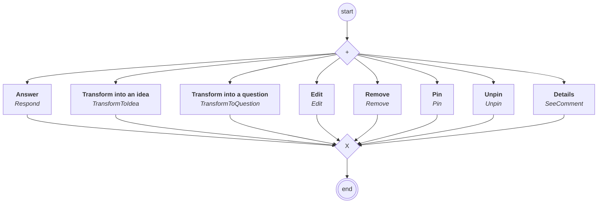

# content.processes.comment_management

This module represent the Comment management process definition
powered by the dace engine. This process is unique, which means that
this process is instantiated only once.

## Process `commentmanagement`

| Node | Type | Title | Behaviors |
|---|---|---|---|
| `respond` | activity | Answer | `Respond` |
| `edit` | activity | Edit | `Edit` |
| `remove` | activity | Remove | `Remove` |
| `pin` | activity | Pin | `Pin` |
| `unpin` | activity | Unpin | `Unpin` |
| `transformtoidea` | activity | Transform into an idea | `TransformToIdea` |
| `transformtoquestion` | activity | Transform into a question | `TransformToQuestion` |
| `see` | activity | Details | `SeeComment` |

