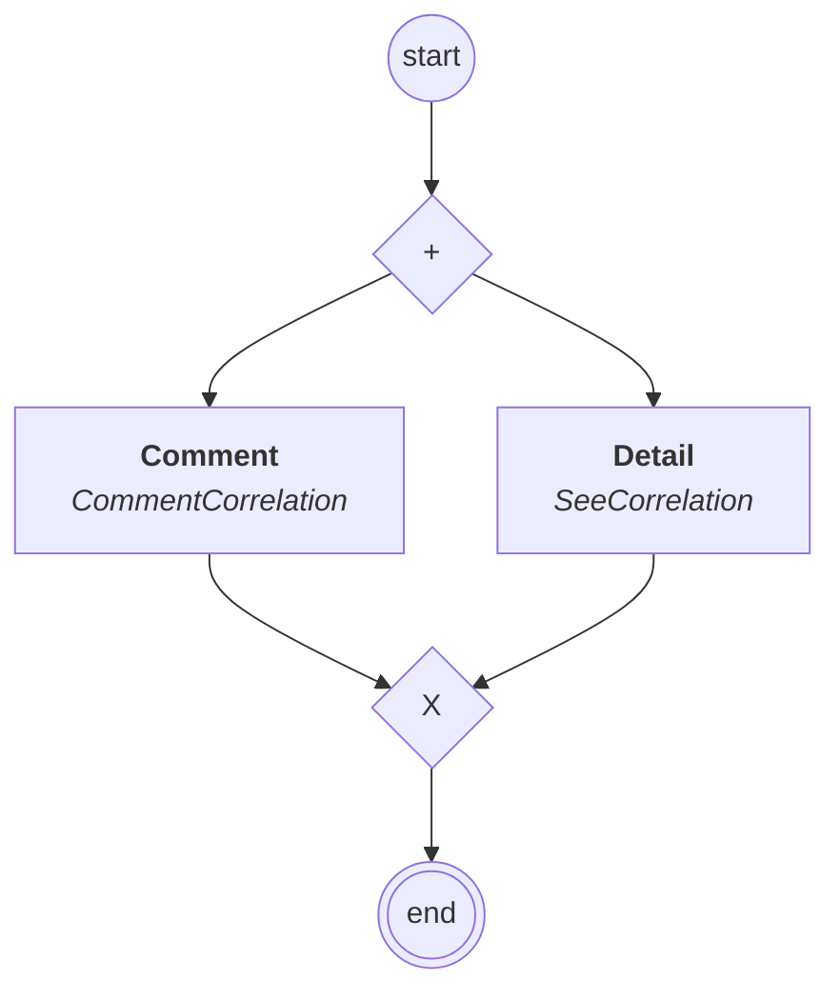

# content.processes.correlation_management

This module represent the Correlation management process definition
powered by the dace engine. This process is unique, which means that
this process is instantiated only once.

## Process `correlationmanagement`

| Node | Type | Title | Behaviors |
|---|---|---|---|
| `comment` | activity | Comment | `CommentCorrelation` |
| `see` | activity | Detail | `SeeCorrelation` |

