# content.processes.idea_management

This module represent the Idea management process definition
powered by the dace engine. This process is unique, which means that
this process is instantiated only once.

## Process `ideamanagement`

```mermaid
flowchart TD
    n_start(("start"))
    n_creat["<b>Create an idea</b><br/><i>CreateIdea</i>"]
    n_creatandpublish["<b>Create an idea</b><br/><i>CrateAndPublish</i>"]
    n_creatandpublishasproposal["<b>Create a Working Group</b><br/><i>CrateAndPublishAsProposal</i>"]
    n_duplicate["<b>Duplicate</b><br/><i>DuplicateIdea</i>"]
    n_delidea["<b>Delete</b><br/><i>DelIdea</i>"]
    n_edit["<b>Edit</b><br/><i>EditIdea</i>"]
    n_submit["<b>Submit for publication</b><br/><i>SubmitIdea</i>"]
    n_submit_max["<b>Submit for publication</b><br/><i>SubmitIdeaMax</i>"]
    n_archive["<b>Archive</b><br/><i>ArchiveIdea</i>"]
    n_publish["<b>Publish</b><br/><i>PublishIdea</i>"]
    n_recuperate["<b>Restore</b><br/><i>RecuperateIdea</i>"]
    n_abandon["<b>Archive</b><br/><i>AbandonIdea</i>"]
    n_present["<b>Share</b><br/><i>PresentIdea, PresentIdeaAnonymous</i>"]
    n_comment["<b>Comment</b><br/><i>CommentIdea, CommentIdeaAnonymous</i>"]
    n_associate["<b>Associate</b><br/><i>Associate</i>"]
    n_see["<b>Details</b><br/><i>SeeIdea</i>"]
    n_compare["<b>Compare</b><br/><i>CompareIdea</i>"]
    n_support["<b>Support</b><br/><i>SupportIdea</i>"]
    n_oppose["<b>Oppose</b><br/><i>OpposeIdea</i>"]
    n_withdraw_token["<b>Withdraw my token</b><br/><i>WithdrawToken</i>"]
    n_makeitsopinion["<b>Give one's opinion</b><br/><i>MakeOpinion</i>"]
    n_seeworkinggroups["<b>The working groups</b><br/><i>SeeRelatedWorkingGroups</i>"]
    n_pg{"+"}
    n_eg{"X"}
    n_end((("end")))
    n_start --> n_pg
    n_pg --> n_creat
    n_pg --> n_creatandpublish
    n_pg --> n_seeworkinggroups
    n_pg --> n_creatandpublishasproposal
    n_pg --> n_duplicate
    n_pg --> n_edit
    n_pg --> n_publish
    n_pg --> n_delidea
    n_pg --> n_abandon
    n_pg --> n_recuperate
    n_pg --> n_comment
    n_pg --> n_present
    n_pg --> n_associate
    n_pg --> n_see
    n_pg --> n_compare
    n_pg --> n_submit
    n_pg --> n_submit_max
    n_pg --> n_archive
    n_pg --> n_makeitsopinion
    n_makeitsopinion --> n_eg
    n_pg --> n_support
    n_support --> n_eg
    n_pg --> n_oppose
    n_oppose --> n_eg
    n_pg --> n_withdraw_token
    n_withdraw_token --> n_eg
    n_creat --> n_eg
    n_creatandpublish --> n_eg
    n_creatandpublishasproposal --> n_eg
    n_duplicate --> n_eg
    n_recuperate --> n_eg
    n_abandon --> n_eg
    n_publish --> n_eg
    n_delidea --> n_eg
    n_edit --> n_eg
    n_comment --> n_eg
    n_present --> n_eg
    n_associate --> n_eg
    n_see --> n_eg
    n_compare --> n_eg
    n_submit --> n_eg
    n_submit_max --> n_eg
    n_archive --> n_eg
    n_seeworkinggroups --> n_eg
    n_eg --> n_end
```

| Node | Type | Title | Behaviors |
|---|---|---|---|
| `creat` | activity | Create an idea | `CreateIdea` |
| `creatandpublish` | activity | Create an idea | `CrateAndPublish` |
| `creatandpublishasproposal` | activity | Create a Working Group | `CrateAndPublishAsProposal` |
| `duplicate` | activity | Duplicate | `DuplicateIdea` |
| `delidea` | activity | Delete | `DelIdea` |
| `edit` | activity | Edit | `EditIdea` |
| `submit` | activity | Submit for publication | `SubmitIdea` |
| `submit_max` | activity | Submit for publication | `SubmitIdeaMax` |
| `archive` | activity | Archive | `ArchiveIdea` |
| `publish` | activity | Publish | `PublishIdea` |
| `recuperate` | activity | Restore | `RecuperateIdea` |
| `abandon` | activity | Archive | `AbandonIdea` |
| `present` | activity | Share | `PresentIdea`, `PresentIdeaAnonymous` |
| `comment` | activity | Comment | `CommentIdea`, `CommentIdeaAnonymous` |
| `associate` | activity | Associate | `Associate` |
| `see` | activity | Details | `SeeIdea` |
| `compare` | activity | Compare | `CompareIdea` |
| `support` | activity | Support | `SupportIdea` |
| `oppose` | activity | Oppose | `OpposeIdea` |
| `withdraw_token` | activity | Withdraw my token | `WithdrawToken` |
| `makeitsopinion` | activity | Give one's opinion | `MakeOpinion` |
| `seeworkinggroups` | activity | The working groups | `SeeRelatedWorkingGroups` |

