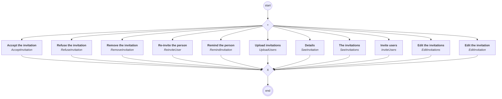

# content.processes.invitation_management

## Process `invitationmanagement`

| Node | Type | Title | Behaviors |
|---|---|---|---|
| `add` | activity | Upload invitations | `UploadUsers` |
| `invite` | activity | Invite users | `InviteUsers` |
| `seeinvitation` | activity | Details | `SeeInvitation` |
| `seeinvitations` | activity | The invitations | `SeeInvitations` |
| `edits` | activity | Edit the invitations | `EditInvitations` |
| `edit` | activity | Edit the invitation | `EditInvitation` |
| `accept` | activity | Accept the invitation | `AcceptInvitation` |
| `refuse` | activity | Refuse the invitation | `RefuseInvitation` |
| `remove` | activity | Remove the invitation | `RemoveInvitation` |
| `reinvite` | activity | Re-invite the person | `ReinviteUser` |
| `remind` | activity | Remind the person | `RemindInvitation` |

