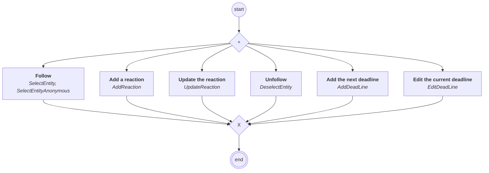

# content.processes.novaideo_abstract_process

## Process `novaideoabstractprocess`

| Node | Type | Title | Behaviors |
|---|---|---|---|
| `select` | activity | Follow | `SelectEntity`, `SelectEntityAnonymous` |
| `deselect` | activity | Unfollow | `DeselectEntity` |
| `addreaction` | activity | Add a reaction | `AddReaction` |
| `updatereaction` | activity | Update the reaction | `UpdateReaction` |
| `adddeadline` | activity | Add the next deadline | `AddDeadLine` |
| `editdeadline` | activity | Edit the current deadline | `EditDeadLine` |

