# content.processes.novaideo_view_manager

## Process `novaideoviewmanager`

```mermaid
flowchart TD
    n_start(("start"))
    n_pg{"+"}
    n_search["<b>Search</b><br/><i>Search</i>"]
    n_home["<b>Home</b><br/><i>SeeHome</i>"]
    n_mycontents["<b>My contents</b><br/><i>SeeMyContents</i>"]
    n_myselections["<b>The items that I follow</b><br/><i>SeeMySelections</i>"]
    n_myparticipations["<b>My working groups</b><br/><i>SeeMyParticipations</i>"]
    n_mysupports["<b>My evaluations</b><br/><i>SeeMySupports</i>"]
    n_seeorderedproposal["<b>Proposals to be examined</b><br/><i>SeeOrderedProposal</i>"]
    n_seeproposalstomoderate["<b>Proposals to be moderated</b><br/><i>SeeProposalsToModerate</i>"]
    n_seeideastomoderate["<b>Ideas to be moderated</b><br/><i>SeeIdeasToModerate</i>"]
    n_seereportedcontents["<b>Reported contents</b><br/><i>SeeReportedContents</i>"]
    n_seeideastoexamine["<b>Ideas to be examined</b><br/><i>SeeIdeasToExamine</i>"]
    n_seeusers["<b>Members</b><br/><i>SeeUsers</i>"]
    n_seehistory["<b>History of processes</b><br/><i>SeeEntityHistory</i>"]
    n_seealerts["<b>Alerts</b><br/><i>SeeAlerts</i>"]
    n_seegraph["<b>View the graph of dependencies</b><br/><i>SeeGraph</i>"]
    n_seedependencies["<b>View associations</b><br/><i>SeeDependencies</i>"]
    n_seeanalytics["<b>Analytics</b><br/><i>SeeAnalytics</i>"]
    n_seeballot["<b>Ballot</b><br/><i>SeeBallot</i>"]
    n_contact["<b>Contact</b><br/><i>Contact</i>"]
    n_eg{"X"}
    n_end((("end")))
    n_start --> n_pg
    n_pg --> n_search
    n_search --> n_eg
    n_pg --> n_seegraph
    n_seegraph --> n_eg
    n_pg --> n_seedependencies
    n_seedependencies --> n_eg
    n_pg --> n_home
    n_home --> n_eg
    n_pg --> n_mycontents
    n_mycontents --> n_eg
    n_pg --> n_myselections
    n_myselections --> n_eg
    n_pg --> n_myparticipations
    n_myparticipations --> n_eg
    n_pg --> n_mysupports
    n_mysupports --> n_eg
    n_pg --> n_seeorderedproposal
    n_seeorderedproposal --> n_eg
    n_pg --> n_seeideastoexamine
    n_seeideastoexamine --> n_eg
    n_pg --> n_seeusers
    n_seeusers --> n_eg
    n_pg --> n_seeideastomoderate
    n_seeideastomoderate --> n_eg
    n_pg --> n_seeproposalstomoderate
    n_seeproposalstomoderate --> n_eg
    n_pg --> n_seereportedcontents
    n_seereportedcontents --> n_eg
    n_pg --> n_seehistory
    n_seehistory --> n_eg
    n_pg --> n_contact
    n_contact --> n_eg
    n_pg --> n_seealerts
    n_seealerts --> n_eg
    n_pg --> n_seeanalytics
    n_seeanalytics --> n_eg
    n_pg --> n_seeballot
    n_seeballot --> n_eg
    n_eg --> n_end
```

| Node | Type | Title | Behaviors |
|---|---|---|---|
| `search` | activity | Search | `Search` |
| `home` | activity | Home | `SeeHome` |
| `mycontents` | activity | My contents | `SeeMyContents` |
| `myselections` | activity | The items that I follow | `SeeMySelections` |
| `myparticipations` | activity | My working groups | `SeeMyParticipations` |
| `mysupports` | activity | My evaluations | `SeeMySupports` |
| `seeorderedproposal` | activity | Proposals to be examined | `SeeOrderedProposal` |
| `seeproposalstomoderate` | activity | Proposals to be moderated | `SeeProposalsToModerate` |
| `seeideastomoderate` | activity | Ideas to be moderated | `SeeIdeasToModerate` |
| `seereportedcontents` | activity | Reported contents | `SeeReportedContents` |
| `seeideastoexamine` | activity | Ideas to be examined | `SeeIdeasToExamine` |
| `seeusers` | activity | Members | `SeeUsers` |
| `seehistory` | activity | History of processes | `SeeEntityHistory` |
| `seealerts` | activity | Alerts | `SeeAlerts` |
| `seegraph` | activity | View the graph of dependencies | `SeeGraph` |
| `seedependencies` | activity | View associations | `SeeDependencies` |
| `seeanalytics` | activity | Analytics | `SeeAnalytics` |
| `seeballot` | activity | Ballot | `SeeBallot` |
| `contact` | activity | Contact | `Contact` |

