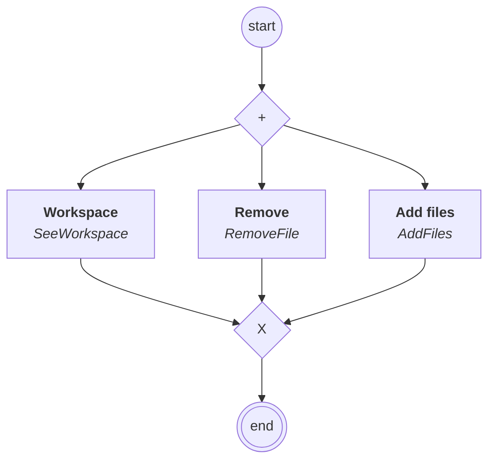

# content.processes.proposal_management

This module represent the Proposal management process definition
powered by the dace engine.

## Process `proposalmanagement`

```mermaid
flowchart TD
    n_start(("start"))
    n_eg{"X"}
    n_pg{"+"}
    n_creat["<b>Create a proposal</b><br/><i>CreateProposal</i>"]
    n_delete["<b>Delete</b><br/><i>DeleteProposal</i>"]
    n_publishasproposal["<b>Create a Working Group</b><br/><i>PublishAsProposal</i>"]
    n_duplicate["<b>Duplicate</b><br/><i>DuplicateProposal</i>"]
    n_publish["<b>Publish</b><br/><i>PublishProposal</i>"]
    n_submit["<b>Submit</b><br/><i>SubmitProposalModeration</i>"]
    n_edit["<b>Edit</b><br/><i>EditProposal</i>"]
    n_participate["<b>Participate</b><br/><i>Participate</i>"]
    n_resign["<b>Quit</b><br/><i>Resign</i>"]
    n_exclude_participant["<b>Exclude a participant</b><br/><i>ExcludeParticipant</i>"]
    n_withdraw["<b>Withdraw</b><br/><i>Withdraw</i>"]
    n_support["<b>Support</b><br/><i>SupportProposal</i>"]
    n_makeitsopinion["<b>Give one's opinion</b><br/><i>MakeOpinion</i>"]
    n_oppose["<b>Oppose</b><br/><i>OpposeProposal</i>"]
    n_withdraw_token["<b>Withdraw my token</b><br/><i>WithdrawToken</i>"]
    n_present["<b>Share</b><br/><i>PresentProposal, PresentProposalAnonymous</i>"]
    n_comment["<b>Comment</b><br/><i>CommentProposal, CommentProposalAnonymous</i>"]
    n_seeamendments["<b>The amendments</b><br/><i>SeeAmendments</i>"]
    n_seemembers["<b>Members</b><br/><i>SeeMembers</i>"]
    n_associate["<b>Associate</b><br/><i>Associate</i>"]
    n_seerelatedideas["<b>Related ideas</b><br/><i>SeeRelatedIdeas</i>"]
    n_compare["<b>Compare</b><br/><i>CompareProposal</i>"]
    n_seeproposal["<b>Details</b><br/><i>SeeProposal</i>"]
    n_attach_files["<b>Attach files</b><br/><i>AttachFiles</i>"]
    n_end((("end")))
    n_start --> n_pg
    n_pg --> n_creat
    n_pg --> n_publishasproposal
    n_pg --> n_duplicate
    n_pg --> n_publish
    n_pg --> n_submit
    n_pg --> n_edit
    n_pg --> n_delete
    n_pg --> n_seerelatedideas
    n_pg --> n_comment
    n_pg --> n_compare
    n_pg --> n_seeamendments
    n_pg --> n_seemembers
    n_pg --> n_associate
    n_pg --> n_present
    n_pg --> n_resign
    n_pg --> n_participate
    n_pg --> n_withdraw
    n_pg --> n_support
    n_pg --> n_makeitsopinion
    n_pg --> n_oppose
    n_pg --> n_withdraw_token
    n_pg --> n_seeproposal
    n_pg --> n_attach_files
    n_pg --> n_exclude_participant
    n_attach_files --> n_eg
    n_seeproposal --> n_eg
    n_creat --> n_eg
    n_publishasproposal --> n_eg
    n_duplicate --> n_eg
    n_publish --> n_eg
    n_submit --> n_eg
    n_edit --> n_eg
    n_delete --> n_eg
    n_seerelatedideas --> n_eg
    n_comment --> n_eg
    n_compare --> n_eg
    n_seeamendments --> n_eg
    n_seemembers --> n_eg
    n_associate --> n_eg
    n_present --> n_eg
    n_resign --> n_eg
    n_participate --> n_eg
    n_withdraw --> n_eg
    n_support --> n_eg
    n_makeitsopinion --> n_eg
    n_oppose --> n_eg
    n_withdraw_token --> n_eg
    n_exclude_participant --> n_eg
    n_eg --> n_end
```

| Node | Type | Title | Behaviors |
|---|---|---|---|
| `creat` | activity | Create a proposal | `CreateProposal` |
| `delete` | activity | Delete | `DeleteProposal` |
| `publishasproposal` | activity | Create a Working Group | `PublishAsProposal` |
| `duplicate` | activity | Duplicate | `DuplicateProposal` |
| `publish` | activity | Publish | `PublishProposal` |
| `submit` | activity | Submit | `SubmitProposalModeration` |
| `edit` | activity | Edit | `EditProposal` |
| `participate` | activity | Participate | `Participate` |
| `resign` | activity | Quit | `Resign` |
| `exclude_participant` | activity | Exclude a participant | `ExcludeParticipant` |
| `withdraw` | activity | Withdraw | `Withdraw` |
| `support` | activity | Support | `SupportProposal` |
| `makeitsopinion` | activity | Give one's opinion | `MakeOpinion` |
| `oppose` | activity | Oppose | `OpposeProposal` |
| `withdraw_token` | activity | Withdraw my token | `WithdrawToken` |
| `present` | activity | Share | `PresentProposal`, `PresentProposalAnonymous` |
| `comment` | activity | Comment | `CommentProposal`, `CommentProposalAnonymous` |
| `seeamendments` | activity | The amendments | `SeeAmendments` |
| `seemembers` | activity | Members | `SeeMembers` |
| `associate` | activity | Associate | `Associate` |
| `seerelatedideas` | activity | Related ideas | `SeeRelatedIdeas` |
| `compare` | activity | Compare | `CompareProposal` |
| `seeproposal` | activity | Details | `SeeProposal` |
| `attach_files` | activity | Attach files | `AttachFiles` |

## Process `proposalimprovementcycle`

```mermaid
flowchart TD
    n_start(("start"))
    n_eg{"X"}
    n_eg1{"X"}
    n_eg2{"X"}
    n_pg{"+"}
    n_votingpublication[["Start voting on publishing the proposal for evaluation &#8594; ballotprocess"]]
    n_timer_alert(("&#9200; alert_end_cycle_duration"))
    n_alert_end["<b>Alert for the end of an improvement cycle</b><br/><i>AlertEnd</i>"]
    n_work[["Start work &#8594; (dynamic)"]]
    n_submit["<b>Submit</b><br/><i>SubmitProposal</i>"]
    n_end((("end")))
    n_start --> n_eg
    n_eg -->|"sync"| n_votingpublication
    n_votingpublication --> n_eg1
    n_eg1 -->|"amendable_condition (sync)"| n_pg
    n_pg --> n_eg2
    n_eg2 --> n_timer_alert
    n_timer_alert --> n_alert_end
    n_alert_end -->|"has_alert_condition (sync)"| n_eg2
    n_pg --> n_work
    n_eg1 -->|"publish_condition (sync)"| n_submit
    n_submit --> n_end
    n_work --> n_eg
```

| Node | Type | Title | Behaviors |
|---|---|---|---|
| `votingpublication` | sub-process | Start voting on publishing the proposal for evaluation | `VotingPublication` |
| `alert_end` | activity | Alert for the end of an improvement cycle | `AlertEnd` |
| `work` | sub-process | Start work | `Work` |
| `submit` | activity | Submit | `SubmitProposal` |

## Process `workspacemanagement`

| Node | Type | Title | Behaviors |
|---|---|---|---|
| `see` | activity | Workspace | `SeeWorkspace` |
| `remove_file` | activity | Remove | `RemoveFile` |
| `add_files` | activity | Add files | `AddFiles` |

