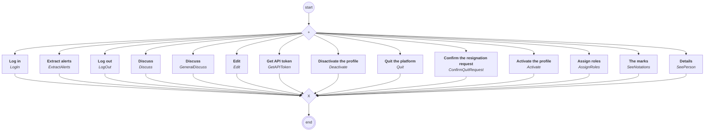
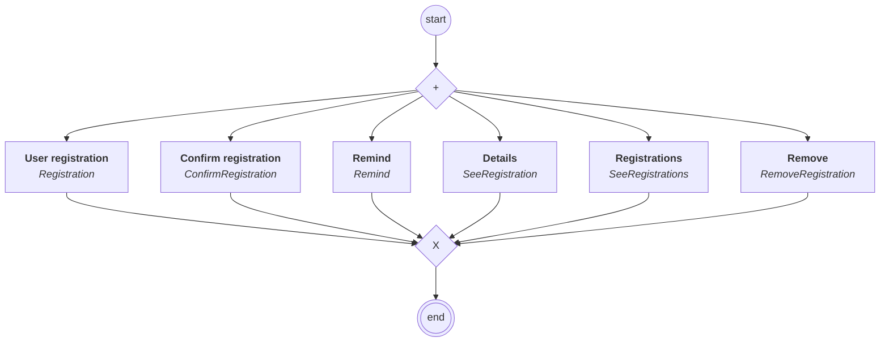

# content.processes.user_management

## Process `usermanagement`

| Node | Type | Title | Behaviors |
|---|---|---|---|
| `login` | activity | Log in | `LogIn` |
| `logout` | activity | Log out | `LogOut` |
| `edit` | activity | Edit | `Edit` |
| `quit` | activity | Quit the platform | `Quit` |
| `confirm_quit` | activity | Confirm the resignation request | `ConfirmQuitRequest` |
| `deactivate` | activity | Disactivate the profile | `Deactivate` |
| `activate` | activity | Activate the profile | `Activate` |
| `assign_roles` | activity | Assign roles | `AssignRoles` |
| `see` | activity | Details | `SeePerson` |
| `see_notations` | activity | The marks | `SeeNotations` |
| `discuss` | activity | Discuss | `Discuss` |
| `get_api_token` | activity | Get API token | `GetAPIToken` |
| `general_discuss` | activity | Discuss | `GeneralDiscuss` |
| `extract_alerts` | activity | Extract alerts | `ExtractAlerts` |

## Process `registrationmanagement`

| Node | Type | Title | Behaviors |
|---|---|---|---|
| `registration` | activity | User registration | `Registration` |
| `confirmregistration` | activity | Confirm registration | `ConfirmRegistration` |
| `remind` | activity | Remind | `Remind` |
| `see_registration` | activity | Details | `SeeRegistration` |
| `see_registrations` | activity | Registrations | `SeeRegistrations` |
| `remove` | activity | Remove | `RemoveRegistration` |

## Process `registrationalert`

```mermaid
flowchart TD
    n_start(("start"))
    n_timer(("&#9200; time_date"))
    n_alert["<b>User registration</b><br/><i>AlertRegistration</i>"]
    n_end((("end")))
    n_start --> n_timer
    n_timer --> n_alert
    n_alert --> n_end
```

| Node | Type | Title | Behaviors |
|---|---|---|---|
| `alert` | activity | User registration | `AlertRegistration` |

