# content.processes.work_mode_processes.amendment_work_mode_process

This module represent the Proposal management process definition
powered by the dace engine.

## Process `amendmentworkmodeprocess`

```mermaid
flowchart TD
    n_start(("start"))
    n_eg1{"X"}
    n_pg1{"+"}
    n_eg2{"X"}
    n_votingamendments[["Start voting on amendments &#8594; ballotprocess"]]
    n_alert["<b>Alert</b><br/><i>Alert</i>"]
    n_timer(("&#9200; calculate_improvement_cycle_date"))
    n_amendmentsresult["<b>Result of the vote on amendments</b><br/><i>AmendmentsResult</i>"]
    n_improve["<b>Improve</b><br/><i>ImproveProposal</i>"]
    n_improveandexplain["<b>Improve and explain</b><br/><i>ImproveProposalAndExplain</i>"]
    n_end((("end")))
    n_start --> n_pg1
    n_pg1 --> n_improve
    n_pg1 --> n_improveandexplain
    n_pg1 --> n_timer
    n_timer --> n_eg1
    n_eg1 -->|"eg4_votingamendments_condition (sync)"| n_votingamendments
    n_eg1 -->|"eg4_alert_condition (sync)"| n_alert
    n_alert --> n_eg2
    n_votingamendments --> n_amendmentsresult
    n_amendmentsresult --> n_eg2
    n_eg2 --> n_end
```

| Node | Type | Title | Behaviors |
|---|---|---|---|
| `votingamendments` | sub-process | Start voting on amendments | `VotingAmendments` |
| `alert` | activity | Alert | `Alert` |
| `amendmentsresult` | activity | Result of the vote on amendments | `AmendmentsResult` |
| `improve` | activity | Improve | `ImproveProposal` |
| `improveandexplain` | activity | Improve and explain | `ImproveProposalAndExplain` |

