# Nova-Ideo, l'innovation participative agile

**Auteur :** Michaël Launay — **Source :** article Ecréall, numéro
d'édition 57, 30 septembre 2021 (« L'innovation participative
libre »).
**Note de transcription (18 juillet 2026) :** ce document est la
transcription fidèle en markdown de l'article de présentation
fonctionnelle — la meilleure documentation du produit, selon l'audit.
Le texte de 2021 est conservé tel quel : les offres, adresses et
perspectives citées sont d'époque (voir le README et
[`audit.md`](audit.md) pour l'état actuel). Les captures d'écran sont
celles de l'interface de 2021 ; leur régénération automatique est
décrite en fin de document. English version:
[`../en/presentation.md`](../en/presentation.md).

> Que ce soit pour la « Démocratie participative » ou « l'innovation
> participative », la majorité des outils de la « CivicTech » reposent
> sur le travail des foules ; nous présentons ici un outil qui permet
> de faire réfléchir la foule (brainstorming).

## 1. Participatif ?

Du 7 au 9 décembre 2016, s'est tenu à Paris l'Open Government
Partnership, un forum réunissant de nombreuses initiatives dites de
« démocratie participative ». Très à la mode, ce terme traduit un
besoin de réappropriation de la prise de décision par les citoyens.
Toutefois de nombreuses associations, dont la QuadratureDuNet, ont
souligné qu'il s'agissait pour l'instant surtout de communication
politique [http://lqdn.fr/node/10118].

L'outil phare de la démocratie participative est la dématérialisation
des consultations citoyennes, et l'on trouve de nombreuses solutions,
dont certaines open source ou libres, qui commencent à satisfaire ce
besoin.

La démocratie participative est à mettre en parallèle avec
l'innovation participative, son pendant dans le monde de l'entreprise
qui prend souvent l'aspect d'une boîte à idées numérique.

Dans les deux cas, il s'agit de demander l'avis des personnes en les
faisant voter ou commenter des textes, et de faire émerger des idées,
des propositions ou contre-propositions en utilisant la sagesse de la
foule.

Dans les deux cas, l'écueil est de susciter de l'enthousiasme sans
pouvoir répondre au trop grand nombre d'idées ou de commentaires.

Nous allons détailler l'une des solutions retenues par Etalab pour
l'OGP Toolbox [https://ogptoolbox.org/fr/tools/7873] et mises à
disposition des administrations, la solution d'innovation
participative Nova-Ideo qui est sous licence libre AGPL v3.

Écrite en Python 3 avec Pyramid, son but est de favoriser les
interactions entre les membres d'un collectif, d'améliorer la récolte
d'idées, et d'organiser la co-écriture de propositions d'action, de
créer des « challenges » afin de répondre à une problématique donnée ;
enfin elle permet à chacun de soutenir ou rejeter les idées,
questions, réponses ou propositions publiées.

Sa force est de faire produire des propositions en utilisant les
mécanismes de collaboration et de compétition (coopétition) que l'on
retrouve dans les cycles itératifs de travail des projets Open Source
— bref, cet outil est très orienté sur l'interaction humaine.

## 2. Installation de Nova-Ideo ou SaaS

Nova-Ideo est disponible sur GitHub et est dockerisé, donc disponible
sur le Docker Hub.

Pour l'installer localement, il suffit de suivre les instructions du
fichier README sur https://github.com/ecreall/nova-ideo. Dans ce cas
aucun support gratuit n'est fourni par Ecréall et la maintenance
ferait l'objet d'un contrat spécifique.

Toutefois, Nova-Ideo est utilisable directement en mode SaaS depuis
l'URL https://www.nova-ideo.com ; gratuitement à la condition que les
contenus soient publics, sur abonnement « Basic » si les contenus
doivent être confidentiels, sur abonnement « Business » si la solution
doit être liée avec un Système d'Information.

## 3. Première utilisation : création d'une idée ou d'une question

La création d'une idée ou d'une question est très simple. Pour cela il
suffit soit d'appuyer sur le bouton vert de création d'un contenu qui
fait surgir le formulaire de saisie, soit de commencer à remplir le
champ de saisie, qui fait apparaître le reste du formulaire.

La différence entre une idée, une question ou une remarque se fait
lors de la saisie. Nova-Ideo se charge de traiter différemment le
contenu en ne faisant apparaître que les actions concernant ce type de
contenu.

L'utilisateur saisit son idée ou sa question, ses mots-clés, et peut
insérer un ou plusieurs fichiers. Il a alors la possibilité de
directement publier son idée et de créer automatiquement un groupe de
travail, de seulement publier son idée, ou d'enregistrer son idée ou
sa question pour pouvoir la travailler par la suite ; enfin il peut
abandonner son édition.

Dans le cas de la saisie d'une question, l'utilisateur peut créer une
question ouverte ou un questionnaire en saisissant les choix.

Dans le cas de la question ouverte, les réponses sont des textes
libres agrégés directement sous l'idée, mais chaque Membre de la
plateforme peut soutenir ou rejeter les réponses proposées.
L'affichage des réponses se fait sous la question par ordre de
soutien.

Dans le cas des choix, chaque Membre qui répond sélectionne le choix
voulu puis argumente sa sélection.

Tout cela est relativement fluide, mais chaque action engendre des
conséquences qui engagent la nature du travail.

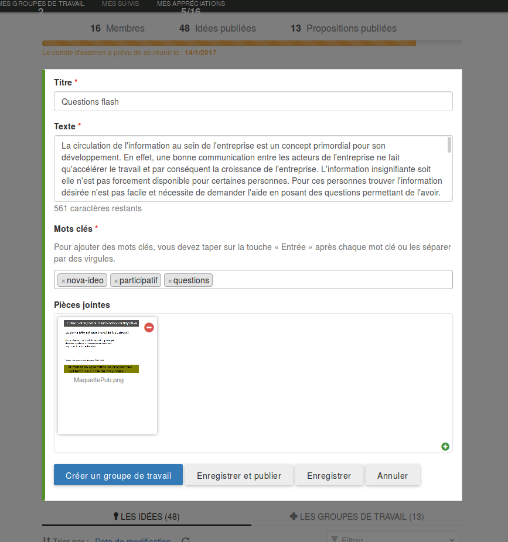

*Illustration 1 : Formulaire de saisie d'une idée, ici le membre
ajoute une idée qu'il a appelée « Questions flash ».*

## 4. Problématique

### 4.1 L'idée est personnelle alors que la proposition est collective

Les gens s'identifient naturellement à leur idée, ainsi critiquer une
idée revient souvent à critiquer son auteur. Bref, avoir de la
distance avec ses productions pour travailler collectivement
sereinement est nécessaire. Inversement, autant les auteurs vont se
battre pour leur idée, autant ils mettront naturellement de la
distance lorsque le travail est collectif, si bien qu'il faudra
trouver une motivation pour que le travail soit fait.

Nova-Ideo considère l'idée comme un document n'ayant qu'un seul
auteur, qui une fois publiée ne peut plus être modifiée, mais
seulement dupliquée pour être modifiée (« fork »).

Nova-Ideo affiche l'ensemble des idées sous forme de liste ou sous
forme de boîtes dont on peut choisir les critères de recherche et de
tri.

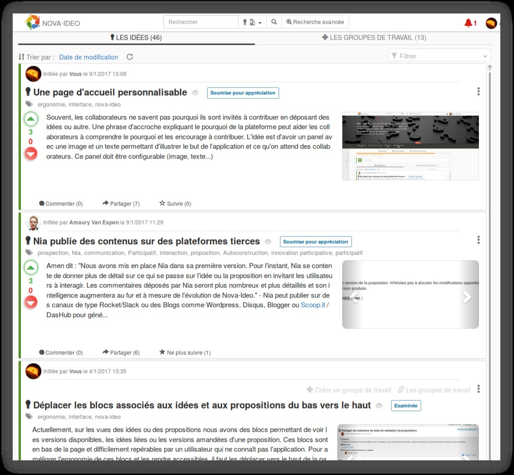

*Illustration 2 : Page d'accueil affichant la liste des idées, cette
vue est paramétrable.*

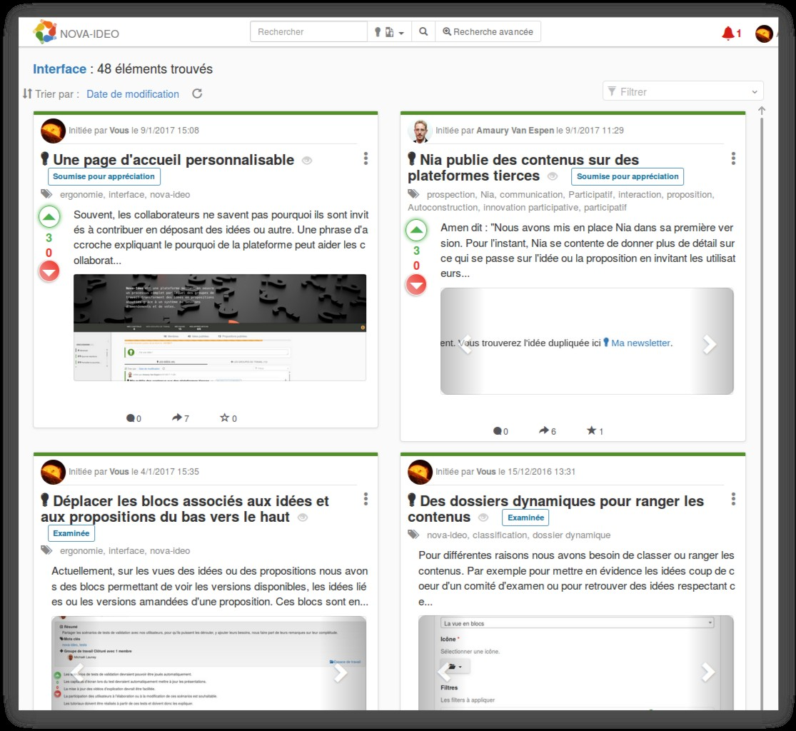

*Illustration 3 : Page d'accueil affichant les idées en blocs, cette
vue est aussi paramétrable.*

### 4.2 Le fork des contenus

La duplication d'une idée permet à tous de s'approprier l'idée d'un
autre, de la modifier tout en reconnaissant la paternité de l'auteur
précédent.

La duplication d'une proposition permet à un nouveau groupe de travail
de bâtir une nouvelle proposition à partir du travail d'un autre
groupe, quel qu'en soit son état. Ainsi le travail n'est jamais perdu,
mais est malléable à souhait pour explorer de nouvelles pistes.

Nova-Ideo conserve un historique des versions qui est accessible
depuis le menu des actions.

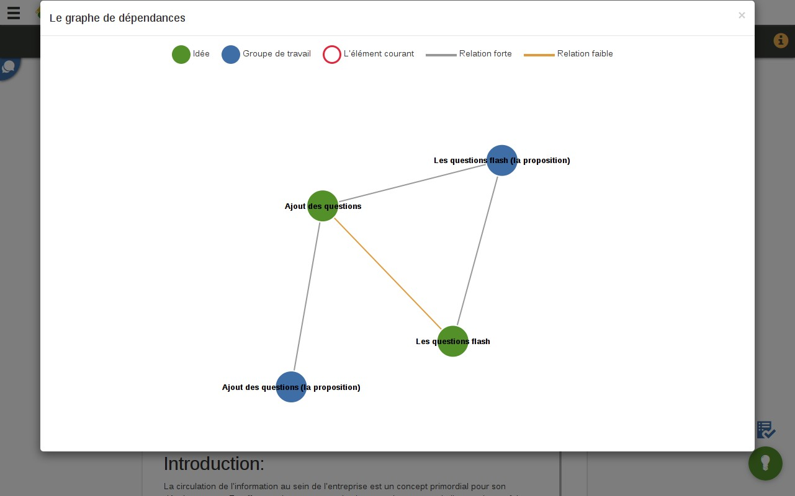

*Illustration 4 : Duplication (fork) d'une idée, cela permet de
naturellement avoir l'arborescence des idées.*

### 4.3 Les cartes des contenus

Nova-Ideo trace les duplications de contenus ou leur réutilisation et
permet de naviguer sur le graphique des parentés et liens des
contenus.

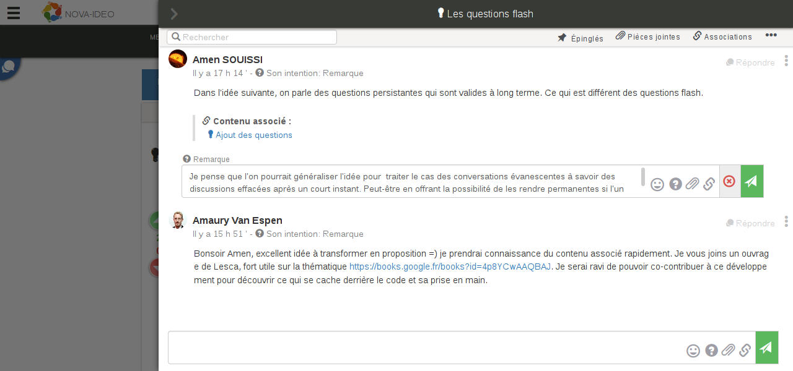

*Illustration 5 : Affichage du graphique des dépendances d'un
contenu.*

### 4.4 Les Challenges d'idées

L'application permet de créer des challenges d'idées et ainsi
d'organiser la présentation de la plateforme en rendant ces challenges
visibles dès l'arrivée sur la plateforme.

Les challenges peuvent aussi servir à structurer la présentation des
idées en regroupant les idées ou questions par thèmes.

Les Challenges peuvent être ouverts à tous les Membres ou restreints à
un sous-ensemble des Membres.

Il est également possible de donner une échéance aux Challenges
au-delà de laquelle il ne sera plus possible de contribuer.

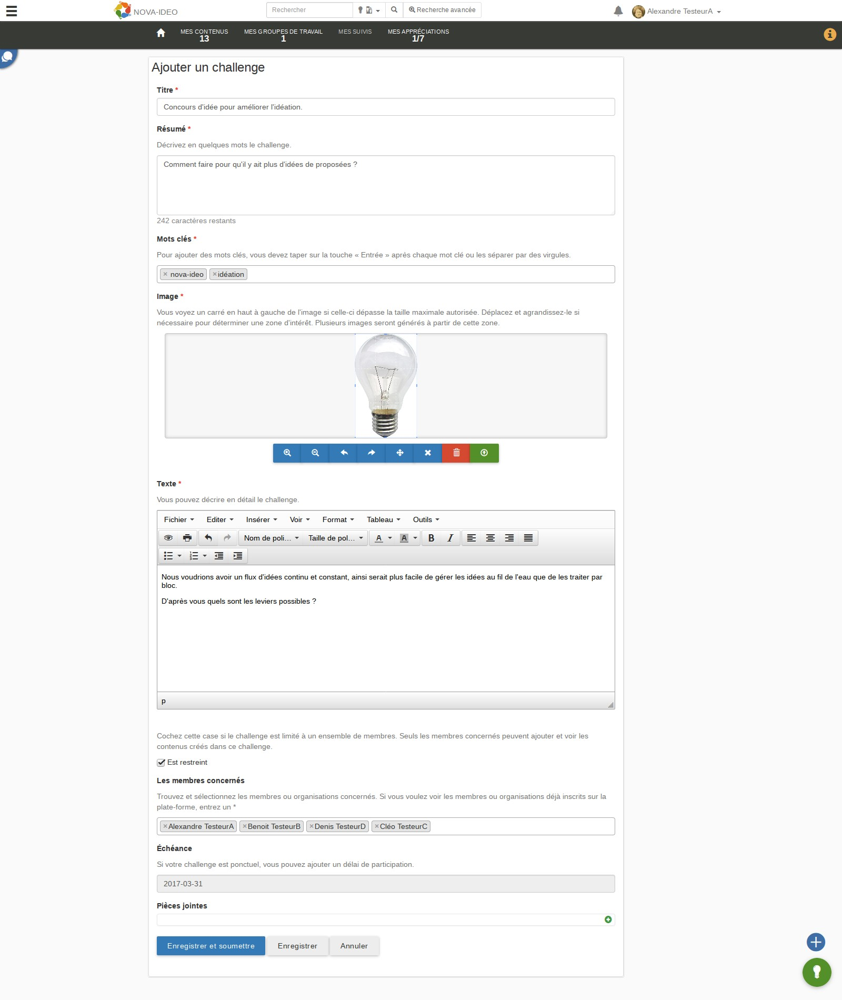

*Illustration 6 : Création d'un challenge.*

Une fois créé, le Challenge permet de créer une coopétition naturelle
des idées puisque chaque Membre voit ce qu'a proposé l'autre et peut à
son tour proposer de nouvelles idées plus innovantes, ou améliorer
celles présentes, ou encore créer ou participer à des groupes de
travail autour des idées du Challenge.

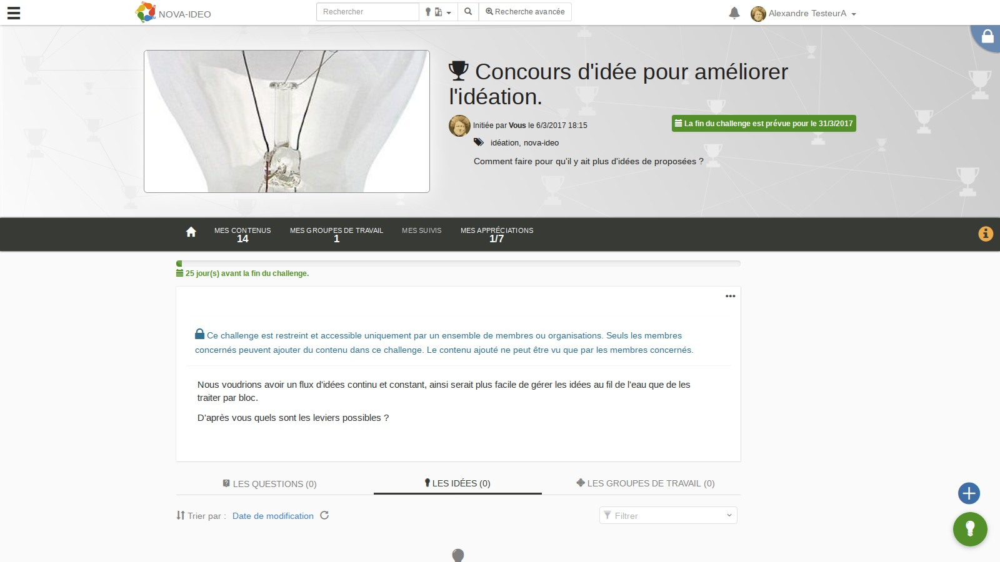

*Illustration 7 : Le challenge publié est visible en tête de site.*

### 4.5 Le travail en groupe

L'homme a un comportement essentiellement coopératif [cf. 8 mn de
https://youtu.be/Adm-8rNBrCU]. Il constitue des groupes pour résoudre
collaborativement des problèmes ; la communication devient alors
l'activité principale de soutien de la réflexion : plus le groupe
échange, plus il a de chances d'aboutir à une solution. Plus les
participants ont des expériences/profils complémentaires, meilleures
seront leurs solutions. Toutefois si les participants d'un groupe ont
des cultures différentes, ils risquent d'avoir besoin de temps pour se
comprendre. Et si les convictions des uns et des autres sont opposées,
alors il faut pouvoir orchestrer les débats pour transformer leur
richesse et éviter les règlements de comptes
[http://www.cornu.eu.org/texts/guide-de-l-animateur].

Pour cela, Nova-Ideo met en avant le travail de groupe et permet de
l'orchestrer à travers un processus métier paramétrable depuis
l'interface d'administration ou totalement adaptable par modification
du code, cela en attendant d'avoir un éditeur de processus intégré.

La création des groupes se fait soit lors de la publication d'une
idée, soit par clic sur l'action « Créer un groupe de travail » ; le
groupe de travail aura alors à coécrire le contenu d'une Proposition
automatiquement créée à partir de l'idée de départ et affectée à ce
groupe.

Le formulaire d'édition de la Proposition permet de saisir un texte
riche. Ce texte riche peut avoir sa mise en forme contrainte par
l'administrateur de manière à suivre un modèle de document.

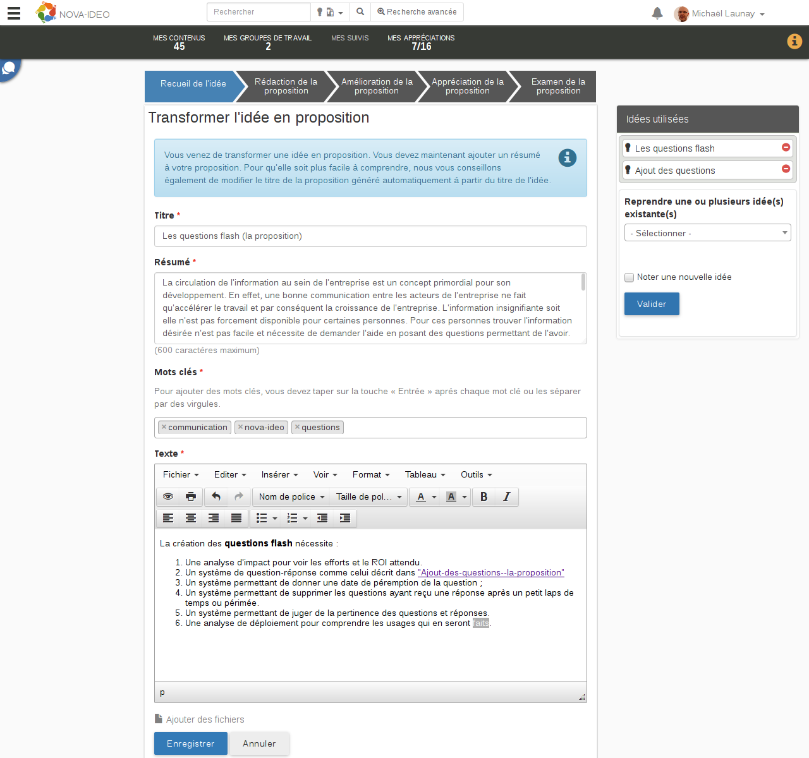

*Illustration 8 : Création d'une proposition à partir d'une idée,
l'idée est reprise dans le résumé. Le texte riche permet par exemple
d'expliquer comment cette idée peut être mise en application. Il
s'agit d'une zone de saisie permettant la co-écriture.*

### 4.6 La taille de groupe optimale

Dès qu'un groupe dépasse la dizaine de personnes, il est difficile
pour ses participants de se connaître suffisamment les uns et les
autres pour être en confiance, et donc être spontanés et efficaces.

Non seulement les participants vont avoir des attitudes de mise en
retrait, mais le nombre de discussions avant action va augmenter selon
la factorielle du nombre de participants
[https://fr.wikipedia.org/wiki/Le_Mythe_du_mois-homme].

C'est contre-intuitif, mais pour retrouver l'efficacité d'un petit
groupe de moins de 12 participants il faudra dépasser la centaine de
participants. Car, dans un grand groupe, on compensera la faible
probabilité d'action par un grand nombre d'acteurs
[http://ebook.coop-tic.eu/francais/wakka.php?wiki=CommentProduireUnDocumentAPlusieursCentai].

De plus, les participants d'un grand groupe cherchent à s'organiser,
ce qui aboutit très souvent à un système hiérarchique pyramidal
classique qui finit par étouffer les idées de sa base.

On tourne en rond, car l'embryon des bonnes idées et réponses vient de
n'importe qui, et pour qu'une idée, une question, une réponse, une
proposition soient bonnes, il faut les avoir travaillées
collectivement pour refléter tous les points de vue.

La solution la plus simple est d'avoir plusieurs petits groupes
travaillant en concurrence sur le même sujet, quitte à ce qu'un autre
groupe fusionne les différentes propositions.

C'est pour cela que par défaut Nova-Ideo limite la taille d'un groupe
à 12 participants, mais cela est paramétrable en ligne et permet
d'expérimenter.

Chaque membre peut rejoindre un groupe de travail en cliquant sur le
bouton « Rejoindre le groupe », mais dès que la limite du nombre de
participants est atteinte, le membre est ajouté sur la liste des
candidats en attente d'une place.

Le nombre maximum de groupes rejoints par un participant est lui-même
paramétrable ; par défaut il est de 5.

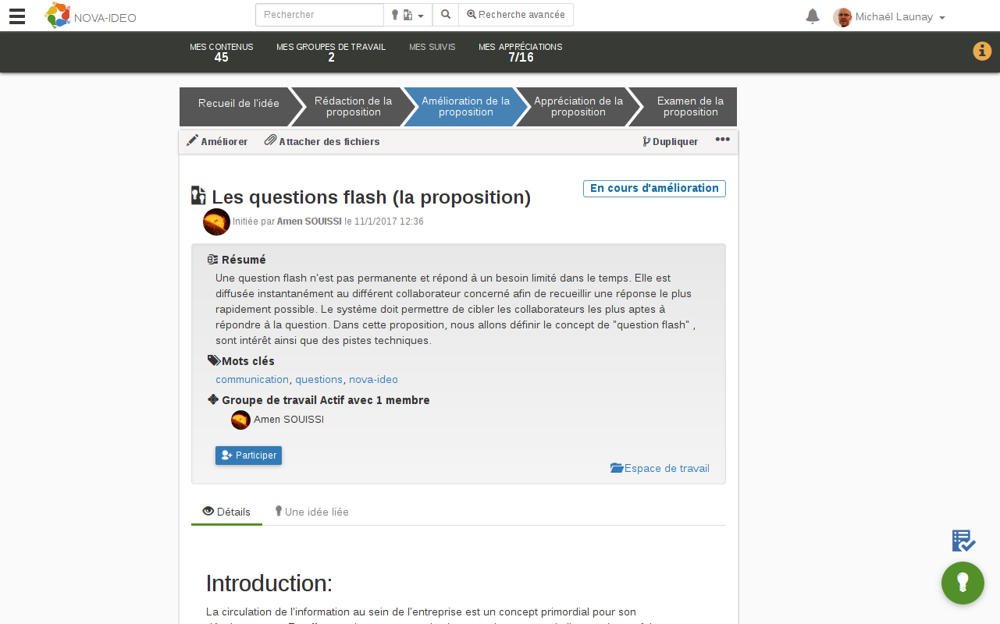

*Illustration 9 : Pour rejoindre un groupe, il suffit de cliquer sur
le bouton « Participer ».*

### 4.7 Le travail itératif et les modes de co-écriture

Même si le groupe est de taille raisonnable, il est rare d'écrire du
premier coup une proposition parfaite ; cela est encore plus vrai
quand plusieurs participants d'un groupe de travail coécrivent le
texte.

Bref, le travail doit être organisé en itérations !

Dès lors différentes méthodes de développement ont montré la nécessité
d'avoir des échéances « courtes ».

Nova-Ideo fait le pari de reprendre le mécanisme du « timeboxing »
(temps limité) des méthodes agiles pour organiser les itérations, mais
laisse le choix de la durée de ces itérations aux participants d'un
groupe.

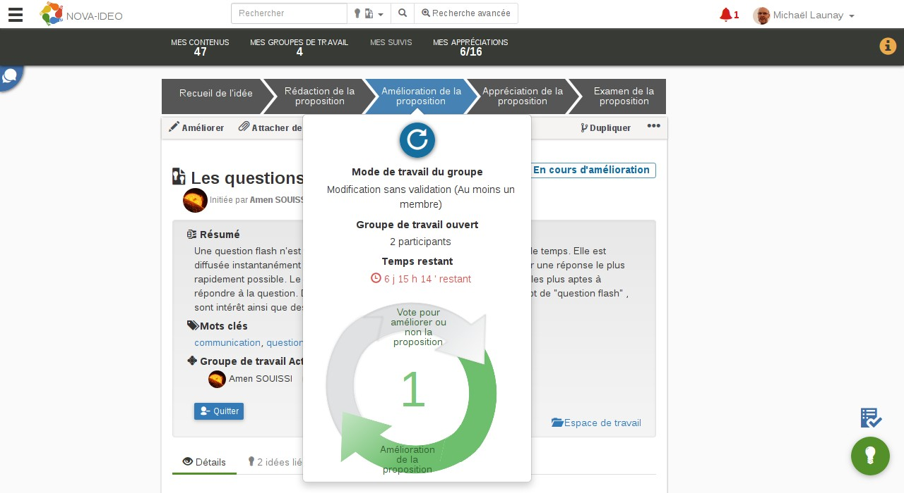

*Illustration 10 : L'état du cycle itératif d'amélioration d'une
Proposition est visible en cliquant sur l'onglet en bleu du
processus.*


*Illustration 11 : Vote pour la durée de l'itération d'amélioration
d'une Proposition.*

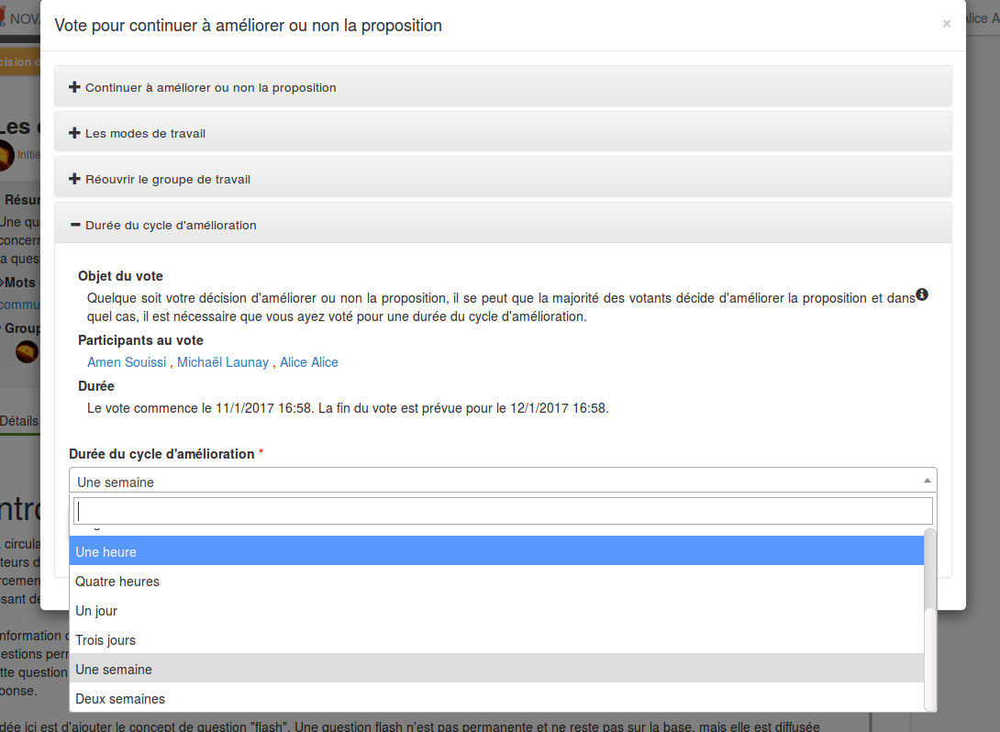

*Illustration 12 : Vote pour la durée de l'itération d'amélioration
d'une Proposition.*

#### Le choix du mode de travail et de la durée de l'itération

Pour chaque itération de travail, les participants votent la
publication de la proposition ou le démarrage d'une nouvelle
itération, et pour le cas où une nouvelle itération commencerait, ils
votent sur la durée de l'itération et son mode de travail.

Actuellement trois modes de co-écriture sont possibles : de type wiki
sans validation, de type séquentiel avec validation, de type parallèle
avec amendements. Ces modes seront détaillés par la suite.

Le but de ces modes de co-écriture est de permettre de converger vers
une proposition faisant le consensus du groupe et publiée pour
soutien.

Les modes sont activables selon le nombre de participants du groupe de
travail.

À tout moment, un participant d'un groupe de travail peut abandonner
son groupe, et comme tout membre peut dupliquer la proposition d'un
groupe de travail pour créer une nouvelle dynamique, on s'attend à ce
que les efforts ne soient jamais perdus, mais réutilisés et
transformés.

Le fait d'axer le travail sur des cycles courts doit éviter
l'enlisement d'un groupe de travail.

Nova-Ideo relance les participants pour leur rappeler la fin de
l'itération ou la nécessité de voter la publication ou non.

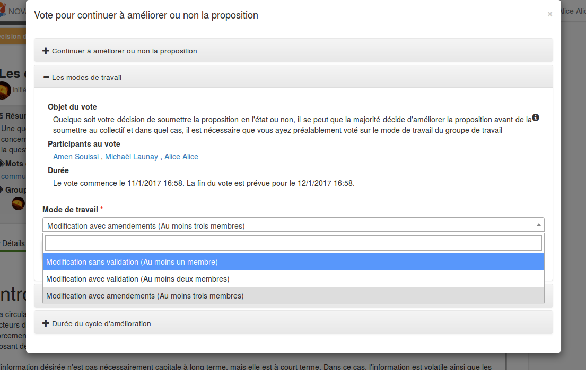

*Illustration 13 : Choix du mode de travail de l'itération
d'amélioration d'une Proposition.*

#### Le mode wiki (pas de validation des modifications)

Dans le mode de travail de type wiki, les modifications des
participants n'ont pas besoin d'être validées par les autres
participants du groupe de travail : dès l'enregistrement elles
génèrent une nouvelle version de la proposition. Très simple, ce mode
de fonctionnement convient dans 80 % des cas, mais son principal
reproche est de donner une importance disproportionnée à la dernière
modification et donc à la possibilité de jouer la montre avant le vote
de publication.

#### Le mode avec validation

Le travail avec validation consiste, pour chaque modification d'une
proposition, à la faire accepter, rejeter ou modifier par un autre
participant du groupe de travail.

Ce processus est séquentiel et ne permet qu'une édition à la fois.
Néanmoins il est très adapté pour les modifications de type
corrections syntaxiques.

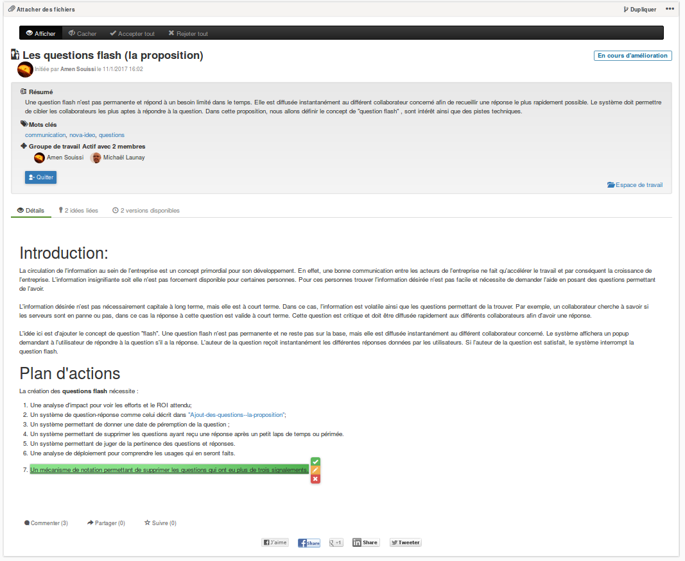

*Illustration 14 : Validation des modifications d'une Proposition, le
participant peut accepter, rejeter ou modifier la modification soumise
par le participant précédent.*

#### Le mode avec amendement

La co-écriture se fait en parallèle : chaque participant modifie la
proposition de son côté sans connaître les modifications des autres.
Ces modifications seront donc mises en concurrence.

Par exemple, un participant modifie une proposition pour en
généraliser le sens et en profite pour reformuler certaines phrases.
Ici nous avons plusieurs modifications de la proposition, certaines
concernent la généralisation du sens et impactent plusieurs phrases à
différents endroits du texte de la proposition, et d'autres sont des
reformulations indépendantes les unes des autres.

Pour cette raison, lorsqu'un participant a fini de travailler, il doit
regrouper et expliquer ses modifications. Une fois fini, il doit
préparer ses amendements et décrire son intention. Ainsi un amendement
contient une ou plusieurs modifications corrélées.

Dans notre exemple, le participant créera un amendement qui contiendra
les différentes réécritures portant sur la généralisation du sens et
des amendements pour les autres reformulations.

À échéance de l'itération, les amendements seront mis au vote selon le
scrutin du jugement majoritaire détaillé ci-après.

Les participants votent les amendements proposés les uns contre les
autres et contre la version d'origine, uniquement lorsqu'ils portent
sur les mêmes parties de la proposition, ou ont la même intention.

L'usage de ce mode de scrutin permet d'obtenir le consensus.

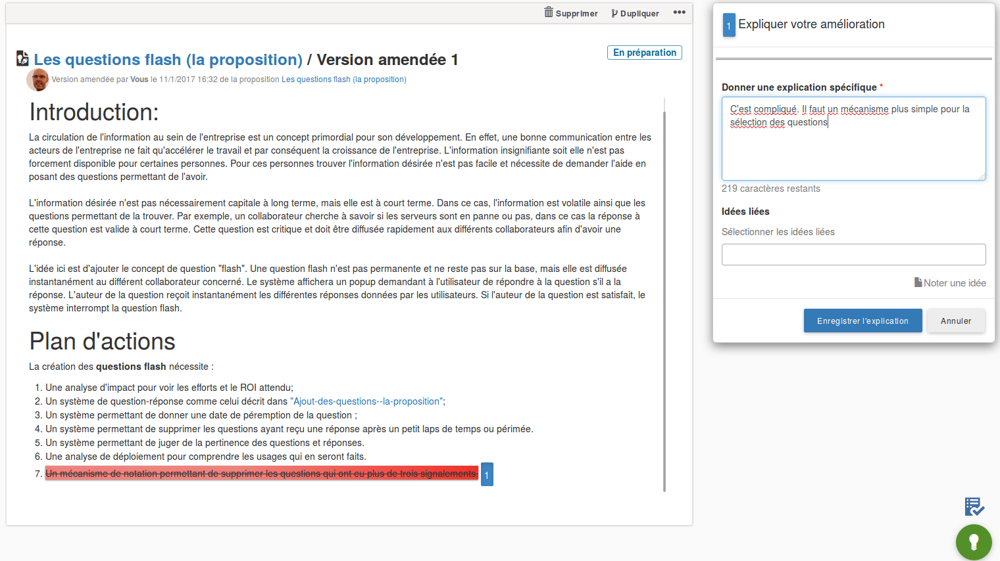

*Illustration 15 : Création des amendements d'une Proposition, il
suffit de regrouper les modifications et de les justifier.*

Une fois le vote sur les amendements réalisé, Nova-Ideo détermine les
modifications ayant fait consensus et les applique. Il crée une
nouvelle version de la proposition et la soumet au groupe pour vote
sur la publication ou le démarrage d'une nouvelle itération de
travail.

### 4.8 Le jugement majoritaire

Le jugement majoritaire est un mode de scrutin issu des travaux de
recherche de Rida Laraki et Michel Balinski
[https://fr.wikipedia.org/wiki/Jugement_majoritaire] ; il est
clairement expliqué par David Louapre sur sa chaîne YouTube « Science
étonnante » [https://youtu.be/ZoGH7d51bvc].

Il répond aux problématiques de vote classique où l'on n'exprime pas
son avis sur tous les choix et où l'on finit par voter pour le moindre
mal le plus proche de son avis.

Ici Nova-Ideo demande à chaque participant de donner à chaque
amendement, dont le texte d'origine, une mention allant de
« Excellent », « Très bien », « Bien », « Assez bien », « Passable »,
« Insuffisant » à « À rejeter ». Nova-Ideo calcule la médiane des
mentions reçues par chaque amendement et conserve celui ayant la
meilleure mention majoritaire. Nous avons ainsi un consensus
permettant à la fin de chaque tour de générer une nouvelle version de
la proposition.

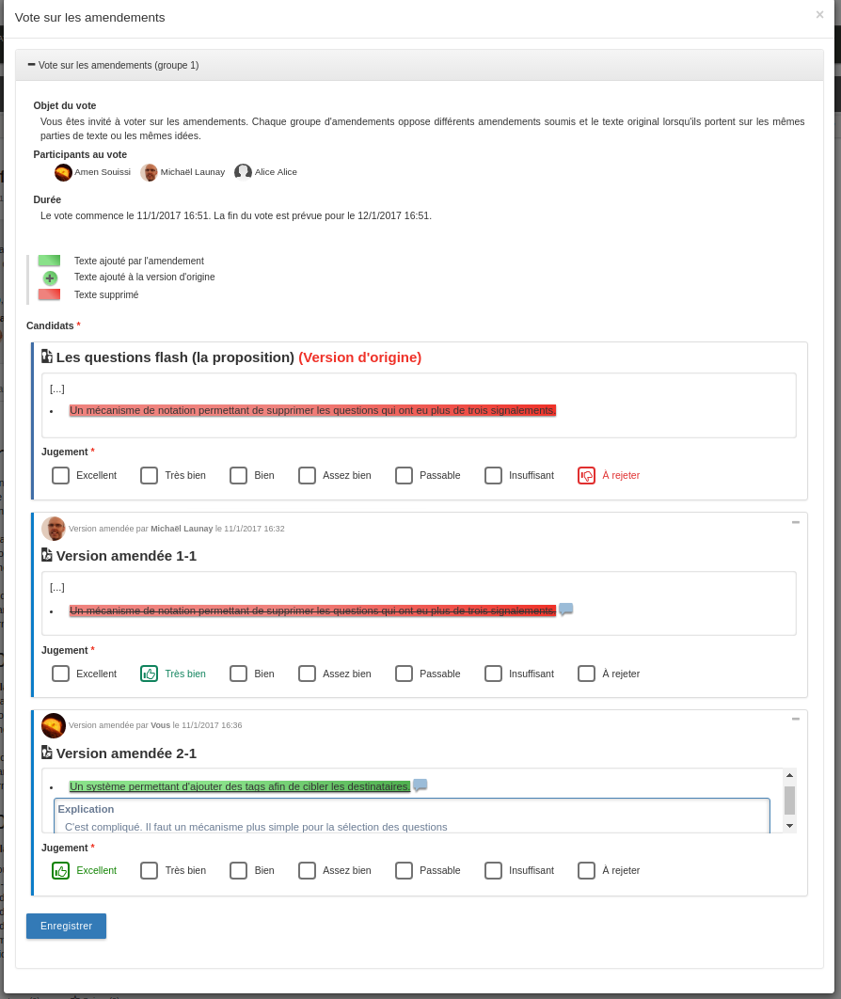

*Illustration 16 : Jugement majoritaire des amendements d'une
Proposition.*

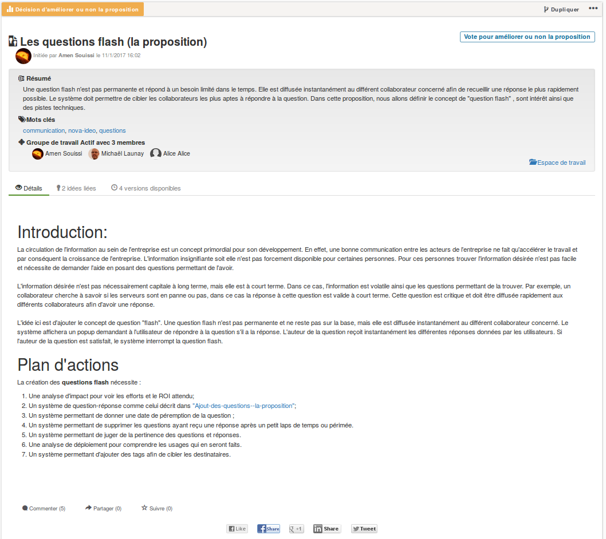

*Illustration 17 : Génération d'une nouvelle version de la
Proposition.*

### 4.9 Les fils de discussion

Nova-Ideo fournit des mécanismes de fils de discussion qui peuvent
être utilisés sur tous les contenus ou directement sur des sujets de
conversation.

Pour laisser un commentaire ou répondre à un commentaire, il suffit de
se placer au bon endroit puis de cliquer sur le bouton commenter.

Les commentaires peuvent inclure des images, des liens, des fichiers
ou des carrousels.

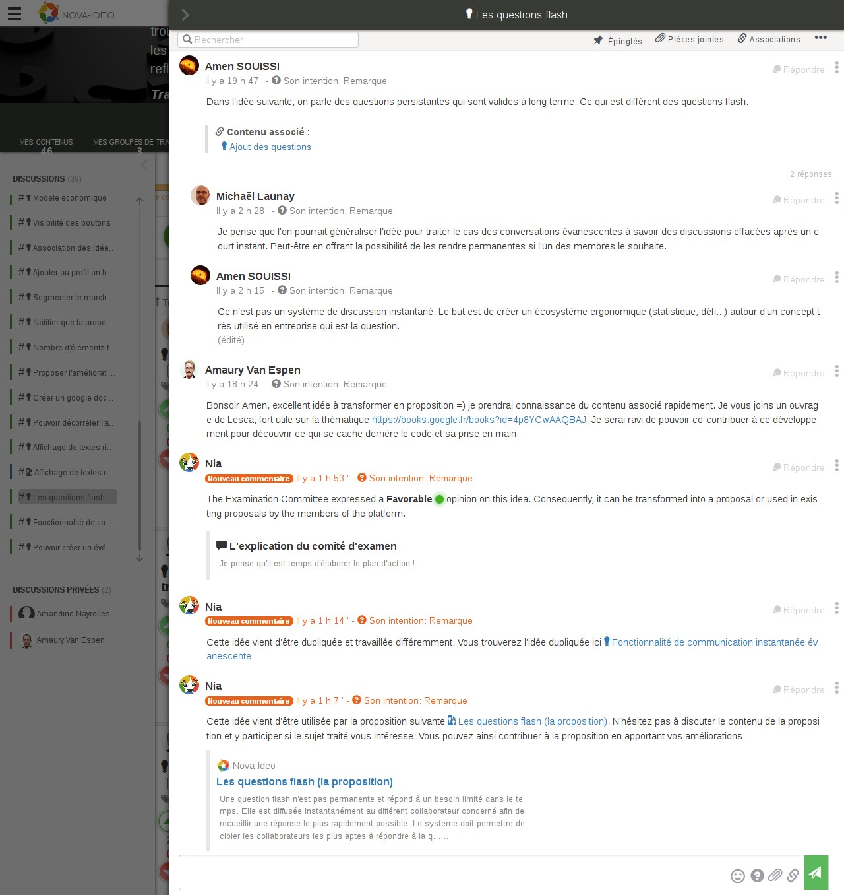

*Illustration 18 : Les membres peuvent alimenter des fils de
discussion sur les contenus, mais également dans des fils généraux
accessibles en cliquant sur la bulle bleue à gauche.*

### 4.10 Les notifications

Nova-Ideo permet d'utiliser le mécanisme des notifications des
navigateurs pour être alerté de tout type d'événement, comme la
création d'un contenu, la publication d'un commentaire, l'expiration
d'une date.

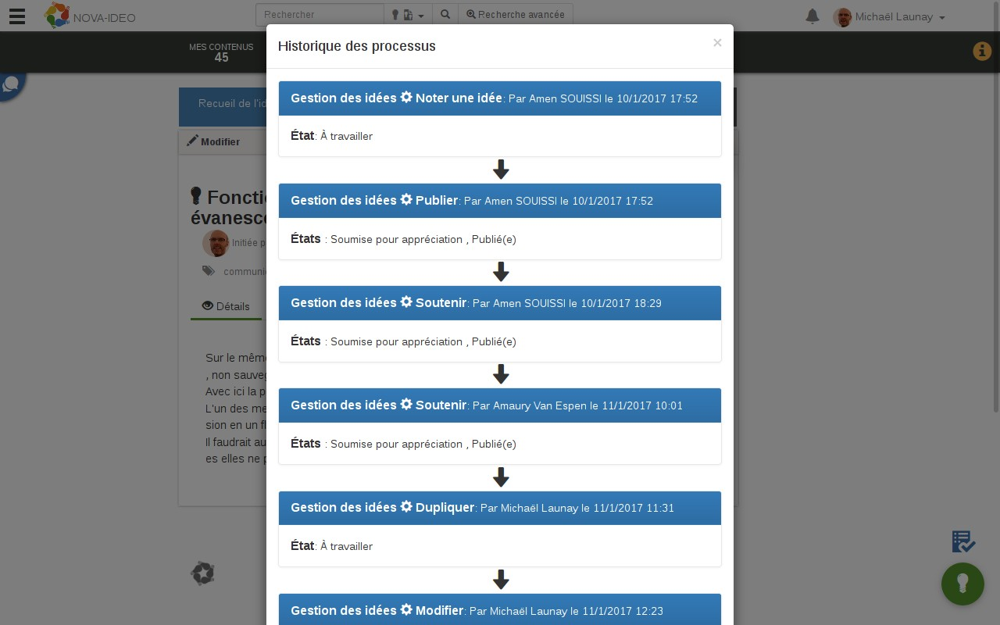

*Illustration 19 : Les membres peuvent être alertés par
notifications.*

### 4.11 Le soutien ou rejet des contenus

Lorsqu'une idée, une proposition ou une réponse à une question est
publiée, tous les membres peuvent la soutenir ou la rejeter.

Mais encore une fois, Nova-Ideo utilise une astuce « sociale », la
rareté des jetons de soutien. Ainsi chaque membre possède 7 jetons
qu'il peut placer pour soutenir ou rejeter un contenu. S'il a utilisé
tous ses jetons, il doit alors faire des arbitrages et déplacer
certains de ses jetons pour les allouer à d'autres contenus. Nova-Ideo
enregistre ces déplacements, et permet ainsi de voir l'évolution des
soutiens. Cela permet par exemple de trouver des saisonnalités dans
les soutiens.

Par exemple, supposons qu'une proposition de mise à disposition de
vélos soit proposée dans une organisation : on peut parier que les
membres auront retiré leur jeton en hiver et les auront remis en été.

Le soutien se fait en utilisant les boutons de type ascenseur situés à
gauche des contenus.

#### Les avis des comités de pilotage

Nova-Ideo permet de gérer des comités de décision, qui peuvent se
prononcer sur la mise en application des propositions.

Pour cela le comité classe les propositions ou idées selon, par
exemple, leur nombre de soutiens, puis il se prononce et publie son
avis.

Nova-Ideo propose différents algorithmes de tri qui peuvent utiliser
l'historique des soutiens.

Par exemple, si un comité de pilotage se tient systématiquement en
hiver et classe les propositions par nombre de soutiens, il ne verra
jamais la proposition de mise à disposition de vélos décrite
précédemment. Maintenant, s'il ajoute un critère de tri historique, il
trouvera la proposition et constatera son intérêt pour l'été suivant.

Une fois sa décision prise, le comité publie son avis sur les
contenus, ce qui se matérialise par un feu tricolore.

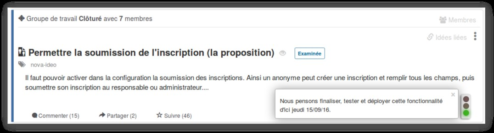

*Illustration 20 : Les membres des comités de pilotage peuvent donner
un avis, ce qui a pour conséquence de relâcher tous les jetons
positionnés sur le contenu.*

## 5. Le code et les contributions

Le projet est issu de la preuve de concept de la thèse d'Amen Souissi
« Modélisation centrée sur les processus métier pour la génération
complète de portails collaboratifs » publiée sur HAL à l'adresse
[https://ori-nuxeo.univ-lille1.fr/nuxeo/site/esupversions/40ca4edc-ad93-4fbe-b70e-eb1b33b50e6a].

La recherche menée permettait de montrer qu'il était possible de
générer 100 % du code d'un portail collaboratif à partir de la
modélisation des processus métier d'une entreprise. Le résultat était
fonctionnellement correct, mais l'interface peu utilisable.

Il a alors été décidé d'inverser la méthode en partant d'un code
« presque parfait » écrit manuellement comme s'il avait été généré
afin de développer les bibliothèques, puis de réécrire toute la chaîne
de transformation et les diagrammes à l'origine de l'outil « idéal ».

Actuellement, les bibliothèques sont écrites, et le code de
l'application Nova-Ideo doit servir de fil conducteur à l'écriture
d'une nouvelle chaîne de transformation, à l'élaboration d'un
formalisme de modélisation fusionnant UML et BPMN, et au développement
d'un Modeleur basé sur cette notation.
[http://video-pyconfr2015.paulla.asso.fr/112_-_Michael_Launay_-_Nova-Ideo,_une_boite_a_idees_collaborative.html]

Nova-Ideo est basé sur ces bibliothèques de modélisation de processus
métier : la création d'un processus revient à instancier différentes
classes Python et à les imbriquer les unes dans les autres.

Une API de programmation de Nova-Ideo a été développée en GraphQL ;
elle permet de réaliser les actions de consultation et création des
contenus depuis d'autres programmes.

Vous pouvez contribuer à l'évolution de Nova-Ideo et proposer vos
idées d'amélioration en vous inscrivant sur evolutions.nova-ideo.com,
qui est bien sûr une instance de Nova-Ideo.

## 6. Bilan de 5 ans d'innovation

Bien qu'ayant quitté la société Ecréall début 2019, Amen Souissi, le
développeur principal, a sporadiquement continué les développements du
projet, qui a alors été supporté plus intensément par Michaël Launay
et partiellement par Vincent Fretin.

Les retours faits par Engie/Axima et ceux reçus de KuneAgi ont permis
de faire les constats suivants :

- besoin d'anonymisation des participations ;
- besoin de simplification du processus de vote majoritaire, soit par
  recours à un assistant intelligent, soit par des coups de pouce de
  l'interface homme-machine ;
- besoin de fusion de la notion d'idée et de proposition — une IA
  basée sur CamemBERT (https://camembert-model.fr/) doit réaliser
  l'identification des idées et automatiser la mise en évidence des
  liens entre idées et propositions ;
- le moteur de processus métier, fruit de la R&D d'Ecréall, aurait
  tout à gagner à être migré en Rust.

Ces nouvelles étapes font l'objet du travail de 2021.

## 7. Conclusion

Nova-Ideo est une application riche qui fait confiance à la volonté
des uns et des autres à collaborer ; or la démocratie participative ou
l'innovation participative ne sont pas qu'affaires d'outil et il
faudra encore beaucoup d'expérimentation sociale avant de trouver les
bons ressorts pour que chacun s'exprime et soit entendu. Mais on peut
penser qu'avec l'amélioration de la connaissance des fonctionnements
des groupes humains, de nouvelles solutions soient apportées, et qu'un
jour l'holacratie [https://fr.wikipedia.org/wiki/Holacratie] ne soit
pas juste un concept.

*Michaël Launay — Gérant fondateur d'Ecréall. Utilisateur GNU/Linux
depuis 2003.*

---

## Annexe (2026) : mettre à jour les captures d'écran

Les vingt figures de ce document portent des **noms sémantiques
stables** (`docs/images/presentation/fig-NN-<sujet>.<ext>`) : les
régénérer suffit à mettre le document à jour, sans toucher au texte.

Le script [`tools/docshots.py`](../../tools/docshots.py) automatise
cette régénération avec Playwright : il se connecte à une instance
(URL et identifiants par variables d'environnement), déroule les
parcours documentés et réécrit chaque figure au même nom. Premier
usage :

```bash
pip install playwright && playwright install chromium
DOCSHOTS_BASE_URL=https://mon-instance \
DOCSHOTS_LOGIN=admin DOCSHOTS_PASSWORD=... \
python tools/docshots.py            # toutes les figures
python tools/docshots.py fig-02 fig-03   # une sélection
```

Le script est un échafaudage volontairement lisible : la table
`SHOTS` en tête de fichier associe chaque figure à sa page et aux
gestes qui l'amènent à l'écran — c'est elle qu'on affine au premier
passage sur l'instance modernisée (les captures actuelles datent de
l'interface 2021).
