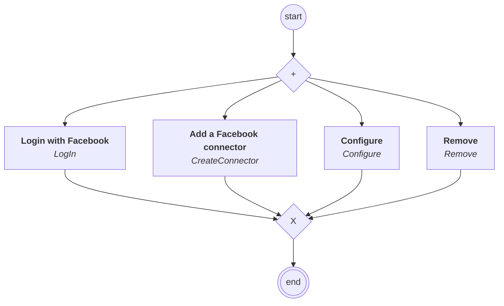

# connectors.facebook.content

## Processus `facebookprocess`

| Nœud | Type | Titre | Behaviors |
|---|---|---|---|
| `login` | activity | Login with Facebook | `LogIn` |
| `create` | activity | Add a Facebook connector | `CreateConnector` |
| `configure` | activity | Configure | `Configure` |
| `remove` | activity | Remove | `Remove` |

