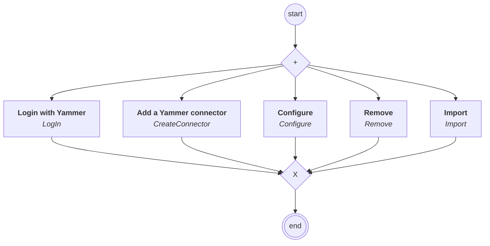

# connectors.yammer.content

## Processus `yammerprocess`

| Nœud | Type | Titre | Behaviors |
|---|---|---|---|
| `login` | activity | Login with Yammer | `LogIn` |
| `create` | activity | Add a Yammer connector | `CreateConnector` |
| `configure` | activity | Configure | `Configure` |
| `remove` | activity | Remove | `Remove` |
| `import_messages` | activity | Import | `Import` |

