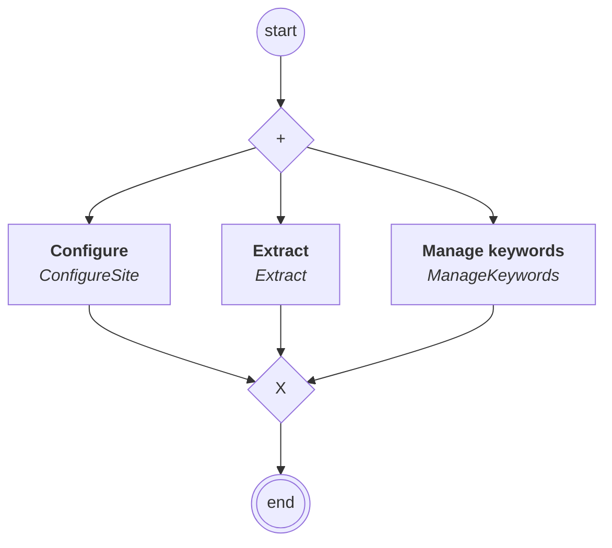

# content.processes.admin_process

## Processus `adminprocess`

| Nœud | Type | Titre | Behaviors |
|---|---|---|---|
| `configure_site` | activity | Configure | `ConfigureSite` |
| `managekeywords` | activity | Manage keywords | `ManageKeywords` |
| `extract` | activity | Extract | `Extract` |

