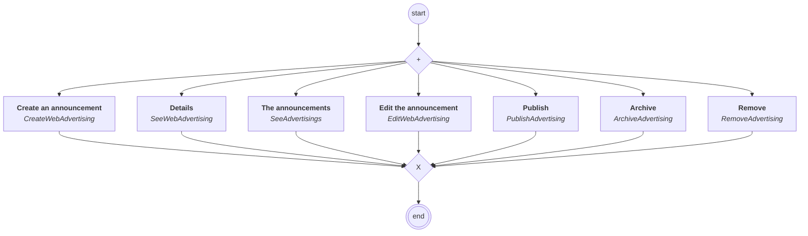

# content.processes.advertising_management

## Processus `advertisingmanagement`

| Nœud | Type | Titre | Behaviors |
|---|---|---|---|
| `creat` | activity | Create an announcement | `CreateWebAdvertising` |
| `edit` | activity | Edit the announcement | `EditWebAdvertising` |
| `see` | activity | Details | `SeeWebAdvertising` |
| `see_all` | activity | The announcements | `SeeAdvertisings` |
| `publish` | activity | Publish | `PublishAdvertising` |
| `archive` | activity | Archive | `ArchiveAdvertising` |
| `remove` | activity | Remove | `RemoveAdvertising` |

