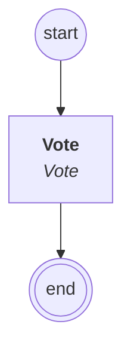

# content.processes.ballot_processes.majorityjudgment

This module represent the Majority Judgment election process definition
powered by the dace engine. This process is vlolatile, which means
that this process is automatically removed after the end. And is controlled,
which means that this process is not automatically instanciated.

## Processus `majorityjudgmentprocess`

| Nœud | Type | Titre | Behaviors |
|---|---|---|---|
| `vote` | activity | Vote | `Vote` |

