# content.processes.ballot_processes

This module represent the Ballot global process definition
powered by the dace engine. This process is unique, which means that
this process is instantiated only once. And is used as part of a sub-process.
And is vlolatile, which means that this process is automatically removed after
the end.

## Processus `ballotprocess`

```mermaid
flowchart TD
    n_start(("start"))
    n_pg{"+"}
    n_timer(("&#9200; time_date"))
    n_conditional(("? event_condition"))
    n_eg{"X"}
    n_end((("end")))
    n_start --> n_pg
    n_pg --> n_timer
    n_pg --> n_conditional
    n_conditional --> n_eg
    n_timer --> n_eg
    n_eg --> n_end
```

