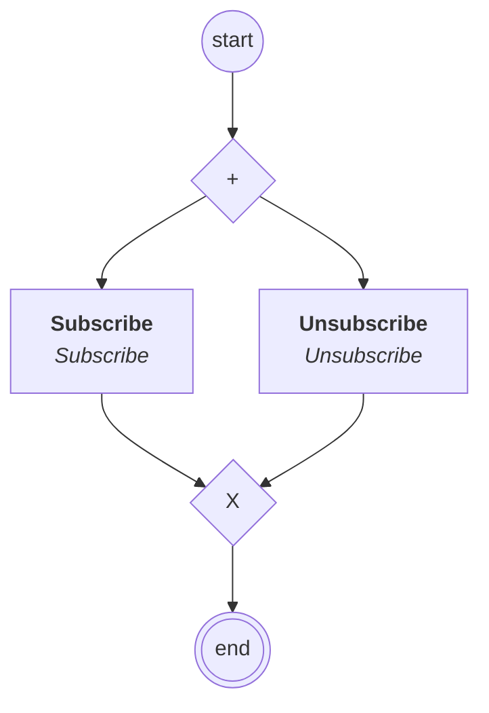

# content.processes.channel_management

This module represent the Channel management process definition
powered by the dace engine. This process is unique, which means that
this process is instantiated only once.

## Processus `channelmanagement`

| Nœud | Type | Titre | Behaviors |
|---|---|---|---|
| `subscribe` | activity | Subscribe | `Subscribe` |
| `unsubscribe` | activity | Unsubscribe | `Unsubscribe` |

