# content.processes.content_ballot_management

## Processus `ContentBallot` *(classe de base, non enregistrée)*

```mermaid
flowchart TD
    n_start(("start"))
    n_start_ballot[["Start the ballot &#8594; ballotprocess"]]
    n_end((("end")))
    n_start --> n_start_ballot
    n_start_ballot --> n_end
```

| Nœud | Type | Titre | Behaviors |
|---|---|---|---|
| `start_ballot` | sub-process | Start the ballot |  |

