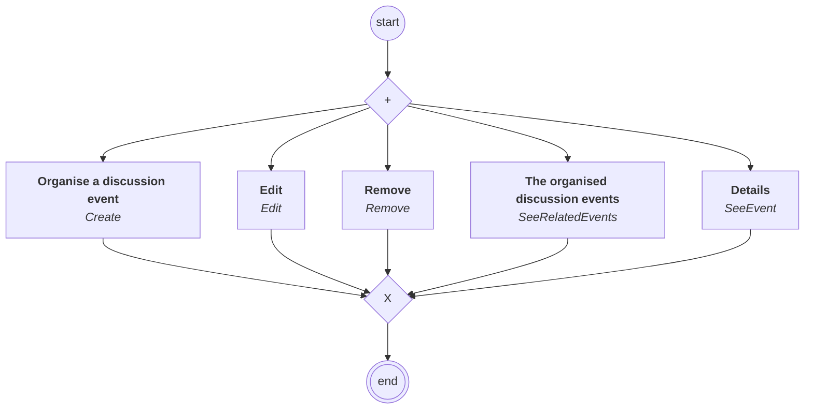

# content.processes.event_management

This module represent the Event management process definition
powered by the dace engine. This process is unique, which means that
this process is instantiated only once.

## Processus `eventmanagement`

| Nœud | Type | Titre | Behaviors |
|---|---|---|---|
| `create` | activity | Organise a discussion event | `Create` |
| `edit` | activity | Edit | `Edit` |
| `remove` | activity | Remove | `Remove` |
| `see_events` | activity | The organised discussion events | `SeeRelatedEvents` |
| `see` | activity | Details | `SeeEvent` |

