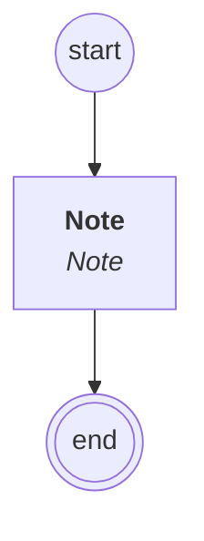

# content.processes.member_notation_management

This module represent the member notation process definition
powered by the dace engine. This process is vlolatile, which means
that this process is automatically removed after the end. And is controlled,
which means that this process is not automatically instanciated.

## Processus `membernotationmanagement`

| Nœud | Type | Titre | Behaviors |
|---|---|---|---|
| `note` | activity | Note | `Note` |

