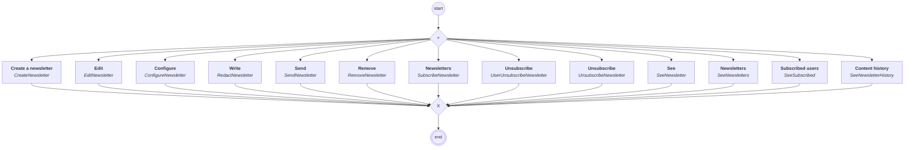

# content.processes.newsletter_management

## Processus `newslettermanagement`

| Nœud | Type | Titre | Behaviors |
|---|---|---|---|
| `creat` | activity | Create a newsletter | `CreateNewsletter` |
| `edit` | activity | Edit | `EditNewsletter` |
| `configure` | activity | Configure | `ConfigureNewsletter` |
| `redact` | activity | Write | `RedactNewsletter` |
| `send` | activity | Send | `SendNewsletter` |
| `remove` | activity | Remove | `RemoveNewsletter` |
| `subscribe` | activity | Newsletters | `SubscribeNewsletter` |
| `unsubscribe` | activity | Unsubscribe | `UserUnsubscribeNewsletter` |
| `unsubscribes` | activity | Unsubscribe | `UnsubscribeNewsletter` |
| `see` | activity | See | `SeeNewsletter` |
| `seesubscribed` | activity | Subscribed users | `SeeSubscribed` |
| `see_all` | activity | Newsletters | `SeeNewsletters` |
| `see_content_history` | activity | Content history | `SeeNewsletterHistory` |

