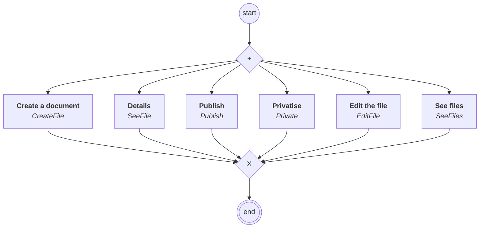

# content.processes.novaideo_file_management

## Processus `novaideofilemanagement`

| Nœud | Type | Titre | Behaviors |
|---|---|---|---|
| `creat` | activity | Create a document | `CreateFile` |
| `editfile` | activity | Edit the file | `EditFile` |
| `seefile` | activity | Details | `SeeFile` |
| `publish` | activity | Publish | `Publish` |
| `private` | activity | Privatise | `Private` |
| `seefiles` | activity | See files | `SeeFiles` |

