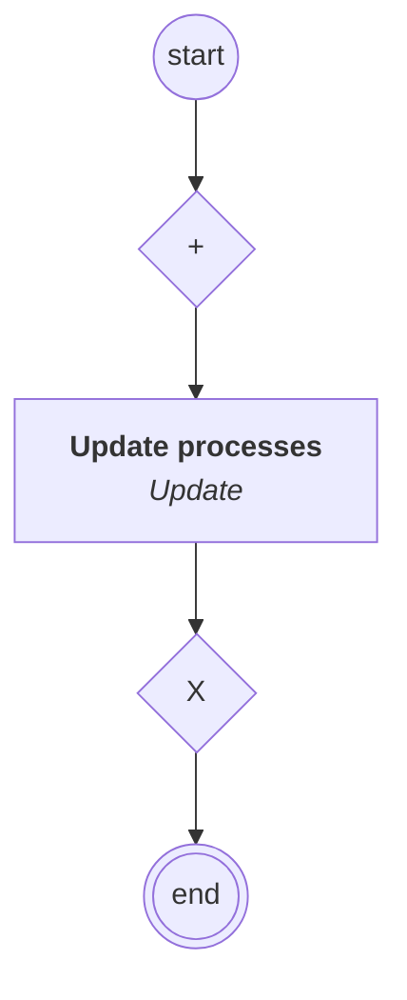

# content.processes.novaideo_process_management

## Processus `novaideoprocessmanagement`

| Nœud | Type | Titre | Behaviors |
|---|---|---|---|
| `update` | activity | Update processes | `Update` |

