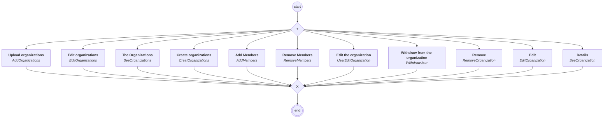

# content.processes.organization_management

## Processus `organizationmanagement`

| Nœud | Type | Titre | Behaviors |
|---|---|---|---|
| `add` | activity | Upload organizations | `AddOrganizations` |
| `creat` | activity | Create organizations | `CreatOrganizations` |
| `edits` | activity | Edit organizations | `EditOrganizations` |
| `sees` | activity | The Organizations | `SeeOrganizations` |
| `edit` | activity | Edit | `EditOrganization` |
| `see` | activity | Details | `SeeOrganization` |
| `remove` | activity | Remove | `RemoveOrganization` |
| `add_members` | activity | Add Members | `AddMembers` |
| `remove_members` | activity | Remove Members | `RemoveMembers` |
| `user_edit_organization` | activity | Edit the organization | `UserEditOrganization` |
| `withdraw_user` | activity | Withdraw from the organization | `WithdrawUser` |

