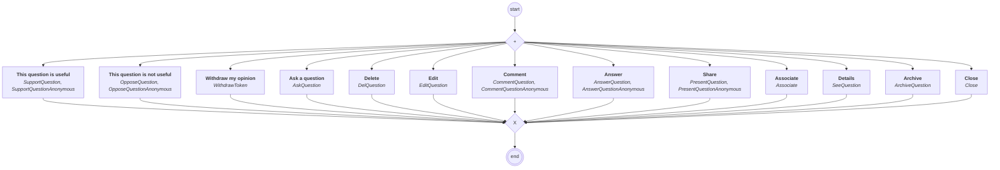
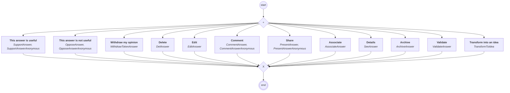

# content.processes.question_management

This module represent the Question management process definition
powered by the dace engine. This process is unique, which means that
this process is instantiated only once.

## Processus `questionmanagement`

| Nœud | Type | Titre | Behaviors |
|---|---|---|---|
| `creat` | activity | Ask a question | `AskQuestion` |
| `delquestion` | activity | Delete | `DelQuestion` |
| `edit` | activity | Edit | `EditQuestion` |
| `archive` | activity | Archive | `ArchiveQuestion` |
| `present` | activity | Share | `PresentQuestion`, `PresentQuestionAnonymous` |
| `comment` | activity | Comment | `CommentQuestion`, `CommentQuestionAnonymous` |
| `answer` | activity | Answer | `AnswerQuestion`, `AnswerQuestionAnonymous` |
| `associate` | activity | Associate | `Associate` |
| `see` | activity | Details | `SeeQuestion` |
| `support` | activity | This question is useful | `SupportQuestion`, `SupportQuestionAnonymous` |
| `oppose` | activity | This question is not useful | `OpposeQuestion`, `OpposeQuestionAnonymous` |
| `withdraw_token` | activity | Withdraw my opinion | `WithdrawToken` |
| `close` | activity | Close | `Close` |

## Processus `answermanagement`

| Nœud | Type | Titre | Behaviors |
|---|---|---|---|
| `delanswer` | activity | Delete | `DelAnswer` |
| `edit` | activity | Edit | `EditAnswer` |
| `archive` | activity | Archive | `ArchiveAnswer` |
| `present` | activity | Share | `PresentAnswer`, `PresentAnswerAnonymous` |
| `comment` | activity | Comment | `CommentAnswer`, `CommentAnswerAnonymous` |
| `associate` | activity | Associate | `AssociateAnswer` |
| `see` | activity | Details | `SeeAnswer` |
| `support` | activity | This answer is useful | `SupportAnswer`, `SupportAnswerAnonymous` |
| `oppose` | activity | This answer is not useful | `OpposeAnswer`, `OpposeAnswerAnonymous` |
| `withdraw_token` | activity | Withdraw my opinion | `WithdrawTokenAnswer` |
| `validate` | activity | Validate | `ValidateAnswer` |
| `transformtoidea` | activity | Transform into an idea | `TransformToIdea` |

