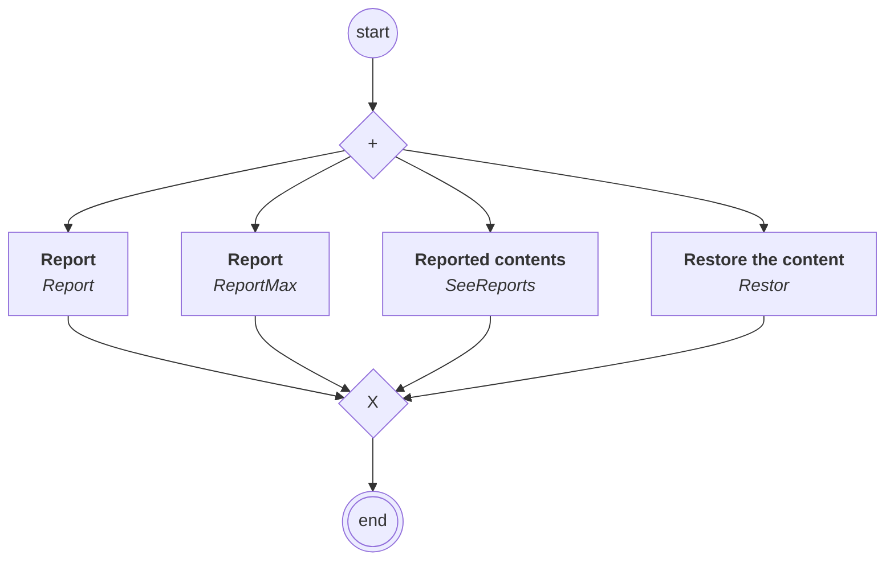

# content.processes.reports_management

## Processus `reportsmanagement`

| Nœud | Type | Titre | Behaviors |
|---|---|---|---|
| `report` | activity | Report | `Report` |
| `report_max` | activity | Report | `ReportMax` |
| `see_reports` | activity | Reported contents | `SeeReports` |
| `restor` | activity | Restore the content | `Restor` |

