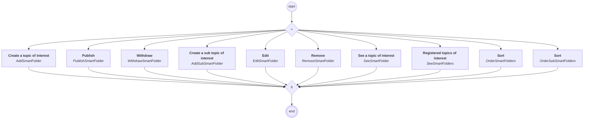

# content.processes.smart_folder_management

## Processus `smartfoldermanagement`

| Nœud | Type | Titre | Behaviors |
|---|---|---|---|
| `add_smart_folder` | activity | Create a topic of interest | `AddSmartFolder` |
| `addsub_smart_folder` | activity | Create a sub topic of interest | `AddSubSmartFolder` |
| `edit_smart_folder` | activity | Edit | `EditSmartFolder` |
| `remove_smart_folder` | activity | Remove | `RemoveSmartFolder` |
| `see_smart_folder` | activity | See a topic of interest | `SeeSmartFolder` |
| `publish_smart_folder` | activity | Publish | `PublishSmartFolder` |
| `withdraw_smart_folder` | activity | Withdraw | `WithdrawSmartFolder` |
| `see_smart_folders` | activity | Registered topics of interest | `SeeSmartFolders` |
| `order_smart_folders` | activity | Sort | `OrderSmartFolders` |
| `order_sub_smart_folders` | activity | Sort | `OrderSubSmartFolders` |

