# content.processes.system_process

## Processus `systemprocess`

```mermaid
flowchart TD
    n_start(("start"))
    n_pg{"+"}
    n_nl_egblock{"X"}
    n_send_newsletter["<b>Newsletter</b><br/><i>SendNewsLetter</i>"]
    n_timernewsletter(("&#9200; calculate_next_date_newsletter"))
    n_egblock1{"X"}
    n_manage_users["<b>Disactivate users</b><br/><i>DeactivateUsers</i>"]
    n_timerblock1(("&#9200; calculate_next_date_block1"))
    n_egblock2{"X"}
    n_manage_contents["<b>Manage contents</b><br/><i>ManageContents</i>"]
    n_timerblock2(("&#9200; calculate_next_date_block2"))
    n_end((("end")))
    n_start --> n_pg
    n_pg --> n_nl_egblock
    n_nl_egblock --> n_send_newsletter
    n_send_newsletter --> n_timernewsletter
    n_timernewsletter --> n_nl_egblock
    n_pg --> n_egblock1
    n_egblock1 --> n_manage_users
    n_manage_users --> n_timerblock1
    n_timerblock1 --> n_egblock1
    n_pg --> n_egblock2
    n_egblock2 --> n_manage_contents
    n_manage_contents --> n_timerblock2
    n_timerblock2 --> n_egblock2
```

| Nœud | Type | Titre | Behaviors |
|---|---|---|---|
| `send_newsletter` | activity | Newsletter | `SendNewsLetter` |
| `manage_users` | activity | Disactivate users | `DeactivateUsers` |
| `manage_contents` | activity | Manage contents | `ManageContents` |

