# content.processes.work_mode_processes.correction_work_mode_process

This module represent the Proposal management process definition
powered by the dace engine.

## Processus `correctionworkmodeprocess`

```mermaid
flowchart TD
    n_start(("start"))
    n_eg1{"X"}
    n_pg1{"+"}
    n_eg2{"X"}
    n_correct["<b>Improve</b><br/><i>CorrectProposal</i>"]
    n_correctitem["<b>Correct</b><br/><i>CorrectItem</i>"]
    n_close_work["<b>Close the work</b><br/><i>CloseWork</i>"]
    n_timer(("&#9200; calculate_improvement_cycle_date"))
    n_end((("end")))
    n_start --> n_pg1
    n_pg1 --> n_correct
    n_pg1 --> n_correctitem
    n_pg1 --> n_timer
    n_timer --> n_close_work
    n_close_work --> n_end
```

| Nœud | Type | Titre | Behaviors |
|---|---|---|---|
| `correct` | activity | Improve | `CorrectProposal` |
| `correctitem` | activity | Correct | `CorrectItem` |
| `close_work` | activity | Close the work | `CloseWork` |

