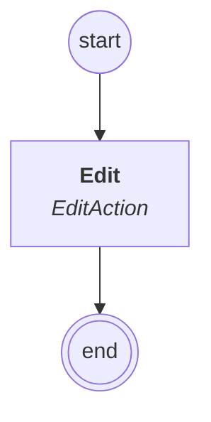

# content.processes.working_group_management

## Processus `workinggroupmanagement`

```mermaid
flowchart TD
    n_start(("start"))
    n_edit["<b>Edit</b><br/><i>EditAction</i>"]
    n_end((("end")))
    n_start --> n_edit
    n_edit --> n_end
```

| Nœud | Type | Titre | Behaviors |
|---|---|---|---|
| `edit` | activity | Edit | `EditAction` |

